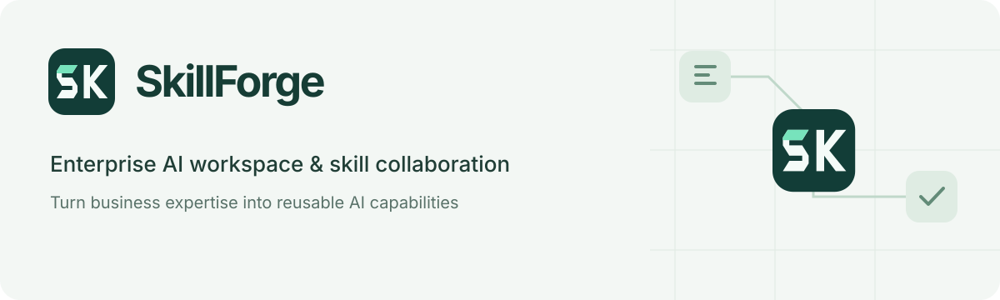

# SkillForge

[简体中文](README.md) · **English** · [Apache-2.0](LICENSE) · [Contributing](CONTRIBUTING.md) · [Issues](https://github.com/xydzf520/skillforge/issues)

**Turn scattered AI applications, working methods and compute resources into capabilities teams can reuse and manage.**

SkillForge is a self-hostable **enterprise AI workspace and skill collaboration platform**. Employees use applications and Skills to complete work; teams manage projects, methods, permissions and versions; connected execution nodes perform tasks, while results and human feedback provide evidence for improvement.

It is intended for teams facing repeated implementation, handoff or shared governance needs. Organizations can retain existing development tools, model services and custom Agent runtimes, integrating incrementally. Benefits must be measured against their existing approach.

[Enterprise value](#value) · [Our view](#future) · [Gateway and compute](#gateway) · [Integration](#harness) · [Data and training](#training) · [Deployment](#quickstart)

<a id="value"></a>
<a id="product"></a>
<a id="projects"></a>
<a id="sharing"></a>

## What it addresses for an organization

| Organizational need | How SkillForge supports it | How to assess value |
|---|---|---|
| **Manage applications created by individuals and departments** | Project brings lightweight web apps, dashboards and internal tools into a directory with owners, departments, visibility, versions and run records | Can colleagues find, use and take over applications, reducing duplicate development and unmaintained tools? |
| **Share validated working methods** | Skills package business rules, prompts, tools and input/output contracts into versioned capabilities, with authorized discovery, installation, revision and review | Can someone other than the author reuse the method with less rediscovery and rework? |
| **Make delivery traceable and accountable** | Organizational access, reviews, run records, reports and tasks connect development, use and human confirmation | Can results be checked, failures diagnosed and actual business completion established? |
| **Reuse existing compute** | Capability gateways, task queues and Bridge nodes connect configured models and execution environments | Does this reduce waiting, repeated deployment or additional capacity needs, including operating costs? |
| **Retain assets for improvement** | Link results and corrections to their sources, then prepare knowledge, Skill improvements and qualified training samples | Does subsequent work become more reliable under the same evaluation criteria? |

Project manages application entry points and runs; applications with their own backend still need an environment. Skill sharing covers methods and versions. A catalog entry alone does not establish validation or adoption. [Projects and shared capabilities](docs/public/PROJECTS_AND_INTEGRATION.en.md).

<a id="enterprise"></a>
<a id="authoring"></a>

## How an organization uses it

1. **Define the task and standards**: the business owner specifies inputs, decision evidence, outputs, acceptance criteria and actions requiring human confirmation.
2. **Build and reuse methods**: teams author Skills, compose workflows or integrate Projects, reusing capabilities before filling gaps. Test, then follow the relevant review and release process.
3. **Deliver to the team**: employees open applications in the browser; development tools or custom Harnesses call authorized capabilities; node-based tasks run in configured environments.
4. **Verify and improve**: owners accept, correct or reject results and record exceptions; maintainers update knowledge, methods or models, then validate the next version.

**Business owners own outcomes, capability maintainers own methods and versions, and platform teams own integration and operation.** Generated reports, sent notifications, execution success and business completion are recorded separately. [Organizational and runtime diagrams](docs/public/OPERATING_MODEL.en.md) · [Skill authoring guide](docs/guides/skill-authoring-best-practices.md) (Chinese).

<a id="future"></a>

## Our view of the future

**Models will keep improving, while organizations still need control of their business assets.** Workflows express steps, prompts express objectives and standards, Skills package reusable methods, and logs linked to outcomes and human corrections provide evidence. Assets gain value through validity, provenance and reuse, with access, quality and retention controls.

**Strong models and private small models can serve different purposes.** Strong models can help explore new or complex tasks. Frequent, stable tasks with qualified examples may justify private small-model fine-tuning. Where the base-model license permits, organizations can deploy privately and retain proprietary data and fine-tuned artifacts. Prices change, and small models also incur compute and maintenance costs; compare quality, latency and total cost on the same task.

**Tools can evolve while validated methods should remain reusable where possible.** Open interfaces and custom Harnesses preserve integration choices; changing models or frameworks still requires testing. These are product directions. General automatic model selection, sustained returns and a complete self-improving production loop have not been accepted in production.

<a id="case-study"></a>

## About the author and career interests

I have **over 10 years of product experience** across consumer applications, enterprise SaaS and smart hardware, with experience in product growth, cross-functional team management and enterprise AI implementation. I am seeking **product leadership, senior specialist or AI product roles in Shanghai**.

<a id="edition"></a>
<a id="validation"></a>

## Current edition at a glance

This is an **Apache-2.0 public preview**. Source code, targeted regression, builds and isolated deployment records are available. Full backend regression and enterprise production acceptance remain incomplete.

| Scope | Current status |
|---|---|
| Projects, Skill editing and sharing, permissions, versions and review | Implementation foundations exist; deployment, configuration and organizational acceptance are required |
| Model calls, gateways, nodes, data and training | Integration and execution foundations exist; provide your own services, models, data and compute, and accept each path separately |
| Embedded Workbench coding chat and full-file generation through the retired runtime | **Unavailable**; external tools and plugins have separate integration paths, while a replacement runtime remains unaccepted |
| Continuous enterprise operation | Data-export defaults, persistent prompt selection, isolated optimizer evaluation and complete backup/recovery still need work |

[Capabilities and limitations](docs/public/CAPABILITIES.en.md) · [Actual validation record](docs/public/RELEASE_CHECK_20260920.en.md) · [Release boundary](docs/public/RELEASE_BOUNDARY.md).

<a id="gateway"></a>

## Gateway: put idle enterprise resources to work

**Using authorized, connected spare server and workstation capacity for model inference, small-model fine-tuning and image generation is an important purpose of the gateway and node architecture.** The aim is to reuse compute and reduce repeated deployment and waiting. Actual speed and cost depend on models, hardware, data transfer and workloads.

The platform manages identities, capability entry points, tasks, versions and run records; Bridge connects execution environments. Available resource information includes online state, GPUs, free VRAM and some queue information. Training and selected media paths use these signals to choose eligible nodes.

| Workload | Existing foundation | Integration requirements |
|---|---|---|
| **Model inference** | Model configuration, Project Gateway, resident-model and trained-model inference interfaces | Configure models, inference runtimes and authorization; some compatibility paths still use fixed targets |
| **Small-model fine-tuning** | Samples, dataset versions, training-resource selection, LoRA / QLoRA tasks, artifacts and evaluation collection | Qualified data, compatible models, compute/VRAM and training runners; execute after approval |
| **Image and media generation** | Image capability/service calls, media tasks and artifact records; selected media tasks dispatch by capability, VRAM and queue state | Configure the image service or runner; routing image generation to spare internal GPUs still needs path-specific integration and acceptance, which an external API success does not establish |

The path is **application / Agent → authorized gateway → workload service and available execution environment → status, artifacts and usage returned**. Node schedules are the primary path, with platform fallback. Multiple modules provide this coordination; a general compute pool with arbitrary-device support, unified scheduling across all workloads and cross-instance failover has not been accepted.

[Gateway mechanisms and limits](docs/guides/project-gateway-sdk.md#网关职责与分布式协作) · [Node deployment](bridge/README.md) (Chinese).

<a id="harness"></a>
<a id="project-sdk"></a>

## Integration: development tools, SDKs and custom Harnesses

| Integration | Purpose |
|---|---|
| **Codex / Claude Code and the `sf` plugin / CLI** | Discover, install and reuse personal or departmental Skills within authorized scope, test revisions and submit for review; register or upload Projects |
| **MCP** | Discover and call authorized platform tools and data capabilities, reusing integrations |
| **Browser, Node / TypeScript and Python SDKs** | Create runs for web apps, backend services and Agents; record inputs, call capabilities, return reports/tasks and inspect traces |
| **Custom enterprise Harness** | Own the Agent loop, context and tool execution while using SDK/API/MCP interfaces; compatible execution nodes receive configuration and return results through Bridge |

Skill reuse follows **discover → install → use and test → submit revisions for review**. Project integration follows **declare ownership and capabilities → validate the entry point → register → use within scope and return results**. Shared assets and capability entry points do not include personal tool accounts or upstream credentials.

Start with one read-only task: authorize a project → create a run → call one capability → return results → inspect records. SDKs are supplied as repository source; deployers configure models, tools and runners. [Plugin and sharing guide](docs/guides/sf-codex-claude-workflow.md) (Chinese) · [SDK and Harness details](docs/public/PROJECTS_AND_INTEGRATION.en.md) · [Synthetic project examples](docs/examples/projects/README.md).

<a id="assets"></a>
<a id="training"></a>

## Data and training: from work outcomes to the next capability

**Authorized inputs → versioned execution → outputs, calls and human corrections → deduplication, sensitivity handling and quality review → reusable assets.** Choose the improvement path according to the problem:

| Improve | Produce | Validate through |
|---|---|---|
| Data and knowledge | Knowledge with sources, scope and freshness | Retrieval and factual checks |
| Prompts, Skills and workflows | A tested and reviewed revision | Quality, review effort and failure handling on the same cases |
| Model capability | Qualified samples and an independent evaluation set | Dataset version → approval → node training → baseline-model comparison and business evaluation → reviewed deployment → observation / rollback |

Training targets can include stable business classification, extraction, report writing and tool use, selected according to tasks and data. **Logs are not automatically qualified examples, and completed training does not establish improvement.** Label the purpose of failures and corrections, and prevent related-source leakage between training and evaluation.

Skill code and versions live in a separate Git repository; run records, provenance and dataset metadata live in the database; files and model artifacts live in configured storage or nodes. Automatic training and deployment approval are disabled by default, but some Project sample-export paths default to enabled. Review collection, AI analysis, learning and export scope separately before integration.

[Complete data, training and deployment lifecycle](docs/public/DATA_AND_TRAINING.en.md) · [Recording and export configuration](docs/guides/project-gateway-sdk.md#数据记录与训练出口) (Chinese).

<a id="screenshots"></a>

## Core product screenshots

These show the **actual public frontend with synthetic data**, illustrating the product rather than enterprise operation, real training or performance. Click for the original; see [all 11 screenshots and reproduction notes](docs/screenshots/README.md) for the remaining interfaces. The UI is in Chinese.

| Project: manage team applications | Skill: share working methods |
|---|---|
| [](docs/screenshots/project-applications.jpg) | [](docs/screenshots/shared-skill-commands.jpg) |
| Inspect ownership, department and application entry points. | Discover and reuse authorized Skills in the development workflow. |

| Access: make scope explicit | Learning: manage data and training |
|---|---|
| [](docs/screenshots/role-permissions.jpg) | [](docs/screenshots/learning-flow.jpg) |
| Inspect account capabilities and organizational scope. | Inspect assets and task states; actual training requires separate configuration and acceptance. |

<a id="quickstart"></a>
<a id="technology"></a>

## Deployment and evaluation

The platform consists of a **Vue workspace, FastAPI services, PostgreSQL, Redis and a separate Skill Git repository**; the workflow editor uses React. Configure nodes, models and file storage according to the workload.

```bash
git clone https://github.com/xydzf520/skillforge.git
cd skillforge
```

1. **Deploy the control platform**: prepare Python 3.12, Node.js 22.22 or a later compatible version, and npm 11.13.0. Initialize independent configuration and the database, build the frontend and start services. Follow the complete [local deployment guide](docs/public/GETTING_STARTED.en.md) or [isolated Docker preview guide](deploy/preview/README.md). The deployer sets the administrator password; there is no shared default.
2. **Connect models and execution resources**: configure organizational access, models and required tools. To use enterprise compute, install and register a compatible Bridge, then verify capabilities, versions and task reports. Configure training, inference and image-generation runners separately.
3. **Verify before expanding**: start with synthetic data and a read-only workflow, checking inputs, outputs, access and failure handling. Before real business use, verify data scope, stopping behavior and backup/recovery, then have another member use and take over the capability.

For one-off personal tasks, or where existing tools meet the need, assess whether another platform is worthwhile. Establish data authorization, acceptance criteria and maintenance ownership before adoption.

<a id="value-measurement"></a>

**Evaluate quality, end-to-end time, team reuse and total cost per accepted task.** Include implementation, models, compute, human review, rework and operations. Saved time is released capacity before it becomes a verified financial benefit. Adjust or narrow adoption if agreed criteria are not met.

[Enterprise value review and pilot plan](docs/public/ENTERPRISE_VALUE_REVIEW_20260920.md) (Chinese) · [Architecture and code evidence](docs/public/ARCHITECTURE.md) · [Documentation index](docs/README.md).

## License

Unless otherwise noted, project code and documentation use [Apache License 2.0](LICENSE). Third-party components retain their own licenses; see [third-party notices](THIRD_PARTY_NOTICES.md).
