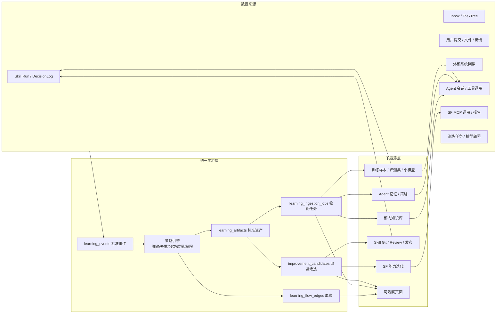

# SkillForge 智能数据流正向循环设计文档

> **阅读范围**：本文保留原项目的设计与版本演进记录，不作为公开准备版的安装或验收指南。正文中的“当前／已完成／已上线”须结合当时版本理解；现行可用范围见[能力地图](../public/CAPABILITIES.md)，实测范围见[验证记录](../public/VALIDATION.md)。规范性权限与审核要求不因该说明而放宽。


日期：2026-06-01

状态：需求讨论沉淀 + 架构方案 v1。产品验收入口见 `docs/spec/intelligence-positive-loop-prd.md`，研发落地规格见 `docs/spec/intelligence-learning-loop.md`。

## 1. 目标

把知识库、Agent、训练、SF、Skill 从“各自可用”升级为“数据持续流动、能力持续变好”的闭环系统：

```text
Skill 运行 / 用户提交 / 外部回推 / SF 调用 / Agent 会话 / 训练结果
  -> 标准学习事件
  -> 脱敏、去重、分类、质量评分、权限判断
  -> 部门知识库、训练样本、Agent 记忆、Skill 改进候选、SF 迭代候选
  -> 审核、训练、灰度、发布、调用
  -> 新运行数据和用户反馈再次回流
```

最终用户必须能在可观察页面看到：一份数据从哪里产生、进入了哪个知识库、被哪个 Agent/Skill/SF 使用、是否形成训练样本、是否产生模型或能力迭代，以及当前卡在哪个治理环节。

## 2. 现状判断

| 模块 | 已有能力 | 当前断点 | 闭环目标 |
| --- | --- | --- | --- |
| Skill | 有运行记录、DecisionLog、报告、待办、审核和 Git 发布链路 | 运行结果没有稳定沉淀为知识、样本和改进候选 | 每次运行都能生成可追踪学习事件，成功结果沉淀，失败结果形成候选 |
| 知识库 | 有部门知识库、LightRAG/向量配置、多模态资料、查询日志 | 知识来源不足，缺少和运行、反馈、训练、SF 的血缘 | 自动形成部门知识库，展示来源、引用、过期和纠错 |
| Agent | 有运行态、会话、工具调用基础 | 缺少长期部门记忆、策略候选和知识使用观测 | Agent 使用部门知识，反馈沉淀为记忆、样本和策略优化候选 |
| 训练 | 有训练任务、网关、部署审批、回滚 | 样本池和样本血缘不足，候选生成不连续 | 从反馈、失败、完成任务中自动积累样本，训练小模型并受控部署 |
| SF | 有 MCP 调用、报告、调用量页面 | 高频失败、重复组合调用、报告模板没有自动产品化 | 自动发现 SF 功能迭代机会，并进入候选/审核/发布链路 |
| Inbox/TaskTree | 有报告、待办和派发结果 | 完成结果没有反哺知识和训练 | 待办完成、驳回、纠错都能成为知识、样本或改进证据 |

核心判断：不应该让模块两两硬连，而要建设一个统一的“学习事件 + 血缘 + 物化策略”中台层，让所有模块通过同一条数据流进入闭环。

## 3. 总体架构



设计原则：

1. **先记录事实，再做自动化**：所有来源先进入 append-only 事件，后续物化可重放、可审计。
2. **自动生成候选，不自动越权发布**：知识、样本、候选可自动生成；Skill 发布、模型激活、SF 能力上线必须审批。
3. **默认脱敏和最小可见**：页面默认只展示脱敏摘要；原始 payload 只保留引用并复用原页面权限。
4. **血缘必须完整**：任何入库、训练、调用、发布、回滚都写边，保证可以从任意对象追到来源和下游。
5. **部门知识优先**：默认以部门为知识和记忆边界，跨部门复用需要明确授权或沉淀为公共模板。

## 4. 关键对象

### 4.1 标准学习事件 `learning_events`

用于记录“发生了什么”。典型事件：

| 事件 | 来源 | 说明 |
| --- | --- | --- |
| `skill.run.completed` / `skill.run.failed` | ExecutionRun | Skill 成功、失败、超时 |
| `decision.created` / `decision.feedback` | DecisionLog | 产出决策、用户采纳/驳回/评分 |
| `inbox.report.created` | Inbox | 报告生成 |
| `todo.completed` | TaskTree/派发任务 | 待办完成、回执、纠错 |
| `knowledge.query.used` | KnowledgeQueryLog | 知识被检索或引用 |
| `agent.thread.completed` | Agent Runtime | Agent 会话和工具链路结束 |
| `sf.mcp.called` / `sf.report.generated` | SF/Codex | SF 工具调用和报告形成 |
| `training.job.completed` / `model.deployed` | Training | 训练、评估、部署、回滚 |

事件必须带：`source_type`、`source_id`、`department`、`org_unit_id`、`skill_id`、`run_id`、`user_id`、`source_hash`、`redacted_summary`、`sensitivity_level`、`policy_result_json`。

### 4.2 标准学习资产 `learning_artifacts`

用于记录“从事件中抽取出了什么”。典型资产：

| 资产类型 | 用途 |
| --- | --- |
| `knowledge_note` | 可入库知识片段 |
| `report_summary` | 报告摘要和指标解释 |
| `qa_pair` | 可供 RAG/Agent 使用的问答对 |
| `training_sample` | SFT、偏好、动作结果样本 |
| `eval_case` | 评测样本和回归测试样本 |
| `agent_memory` | 部门级 Agent 记忆 |
| `skill_improvement_candidate` | Skill 优化候选 |
| `sf_iteration_candidate` | SF 能力迭代候选 |
| `knowledge_review_candidate` | 需要人工确认的知识候选 |

资产必须带：质量分、置信度、标签、目标类型、目标 ID、审核状态、血缘来源。

### 4.3 血缘边 `learning_flow_edges`

用于记录“数据怎么流动”。常用关系：

| 关系 | 示例 |
| --- | --- |
| `produced` | Run 产生 Report |
| `extracted_as` | Report 抽取为 knowledge_note |
| `indexed_as` | knowledge_note 入库为 KnowledgeDocument |
| `used_as_context` | KnowledgeDocument 被 Agent/Skill 使用 |
| `labeled_by` | DecisionLog 被用户反馈标注 |
| `trained_from` | TrainingJob 使用 training_sample |
| `deployed_to` | ModelDeployment 灰度到 Agent/Skill |
| `proposed_change` | 失败事件提出 Skill/SF 改进候选 |
| `reviewed_by` | 候选进入审核、待办或 Review |
| `improved` | 发布/模型部署改善了业务指标 |

### 4.4 物化任务 `learning_ingestion_jobs`

用于记录“自动写到下游是否成功”。下游包括：`knowledge`、`training`、`agent_memory`、`skill_candidate`、`sf_candidate`。任务需要记录策略、重试次数、错误、sink_id 和状态，支持页面展示“卡在哪”。

### 4.5 改进候选 `improvement_candidates`

统一承载 Skill、Agent、SF、知识库、训练的迭代建议。候选不等于发布，必须进入对应治理链路：Skill Git/Review、训练审批、SF 能力审核、Inbox/TaskTree 处理。

## 5. 端到端流转规则

### 5.1 Skill -> 部门知识库

1. Skill 完成运行后捕获 `ExecutionRun`、`DecisionLog`、reports、todos。
2. 抽取报告结论、指标解释、业务建议、完成待办复盘。
3. 脱敏、去重、质量评分。
4. 满足自动策略的写入部门知识库；敏感或低置信度的进入知识审核候选。
5. 写入 `Run -> Report -> Artifact -> KnowledgeDocument` 血缘。

默认策略：

| 数据 | 动作 |
| --- | --- |
| 成功报告摘要、指标解释、已确认建议 | 自动入库 |
| 待办完成回执和复盘 | 自动入库或审核后入库 |
| 客户原始对话、订单明细、密钥、Cookie | 不直接入库，只保留引用或进入审核 |
| 失败堆栈、traceback | 不入知识库，生成改进候选 |
| sandbox / dry-run 输出 | 默认忽略，只做统计 |

### 5.2 用户提交 / 外部回推 -> 知识库 / 训练 / 候选

1. 用户在平台提交的文件、表单、反馈、确认/驳回，以及外部系统回推数据先变成标准学习事件。
2. 结构化数据只保存引用和摘要，不能把原始敏感明细直接塞进知识库。
3. 已确认事实、SOP、复盘进入知识候选或自动入库。
4. 用户纠错、驳回、评分、真实业务结果进入训练样本或评测样本。
5. 反复出现的问题进入 Skill/Agent/SF 改进候选。

### 5.3 知识库 -> Agent / Skill

当前实现要求：知识检索日志中的紧凑 `document_ids` 和富 `sources` 都必须归一化为 `used_as_context` 血缘；当检索 0 命中时自动形成 `knowledge_review_candidate` / `target_type=knowledge` 的知识缺口候选，等待补文档、确认忽略或纳入知识治理。非 Skill 候选通过 `learning_<target_type>_review` 治理队列承接，继续保留 `reviewed_by` 血缘。

1. Agent 和 Skill 通过统一知识检索接口获取部门知识。
2. 检索结果必须带来源、版本、更新时间、置信度。
3. Agent/Skill 使用知识时写 `used_as_context` 血缘。
4. 回答或报告页面需要能显示引用，至少详情中可追溯。
5. 知识过期、权限不足或低置信度时必须提示缺口或拒答，不允许编造。

### 5.4 Agent -> 知识库 / 训练 / Skill

| Agent 行为 | 自动沉淀 |
| --- | --- |
| 高频成功回答 | Agent 记忆或知识候选 |
| 用户修正输出 | 偏好样本、评测样本 |
| 工具选择失败 | Agent 策略候选 |
| 反复手工流程 | Skill 创建候选 |
| 缺少知识导致低置信度 | 知识缺口候选 |

当前落地口径：Agent run / resume / stream 进入 `agent.thread.*` 学习事件；已用知识、模型部署、工具、Skill 分别写入 `used_as_context`、`used_as_model`、`called_tool`、`used_skill` 血缘；Agent 生成的任务合同 / Skill 草案只进入 Skill 改进候选，必须走 Skill Git / Review / 发布。

Agent 的策略候选不能直接改生产策略；需要审核、灰度和回滚。

### 5.5 训练 -> Agent / Skill

1. 用户反馈、完成任务、失败案例和业务结果自动形成训练样本池。
2. 达到阈值后自动创建 `awaiting_review` 训练候选。
3. 训练任务通过训练网关/Agent 执行，记录 dataset manifest、指标、模型产物和评估结果。
4. 模型部署必须走审批、灰度、激活、回滚。
5. Agent/Skill 调用模型时记录部署版本和业务效果，效果再反哺训练样本和候选优先级。

必须补齐三类血缘：

| 链路 | 血缘关系 | 目的 |
| --- | --- | --- |
| 样本 / 候选 -> 训练任务 | `ImprovementCandidate / Run / Skill / LearningArtifact -> TrainingJob`，relation=`trained_from` | 从模型效果追溯到原始反馈、样本和来源 Skill |
| 训练任务 -> 模型产物 | `TrainingJob -> ModelArtifact`，relation=`produced_artifact` | 把网关 callback 返回的 adapter / checkpoint / eval artifact 纳入可观察链路 |
| 训练任务 -> 模型部署 -> Skill | `TrainingJob -> ModelDeployment -> Skill`，relation=`deployed_to` | 证明哪个训练产物进入了哪个 Skill 的灰度或激活路由 |
| 模型部署回滚 | `ModelDeployment -> ModelDeployment`，relation=`rollback_target` | 展示被回滚版本、回滚目标和后续复盘入口 |

训练网关 callback 是真实训练完成入口，必须立即触发学习流捕获；训练失败、部署驳回、部署回滚都不允许静默结束，必须生成 `training_improvement_candidate`，进入训练治理队列。候选用于补充评测样本、调整评估门禁、修复数据集或重新发起受控训练，不能直接替换生产模型路由。

### 5.6 SF -> 知识库 / Skill / SF 迭代

| SF 现象 | 自动生成 |
| --- | --- |
| 高频 MCP 调用 | 部门数据资产热度、报告模板候选 |
| 某工具高频失败 | SF 工具修复候选 |
| 多人重复组合调用 | 固化为新 SF 命令或新 Skill 的候选 |
| SF 生成稳定报告 | 知识库模板、报告模板或 SOP |
| 某类 run 反复被复盘 | Skill 优化候选、评测包 |

SF 写工具仍必须遵守 dry-run / real / idempotency key，不允许因为闭环自动化绕过真实外部副作用审批。

## 6. 可观察页面

新增一级页面建议命名为 `智能闭环` 或 `数据流`，当前研发规格使用 `/learning-flow`。

### 6.1 页面首屏必须回答三个问题

1. **数据从哪里来**：Skill、Agent、SF、Inbox、外部回推、训练。
2. **数据流到哪里去**：知识库、训练样本、Agent 记忆、Skill/SF 候选、模型部署。
3. **现在卡在哪里**：待审核、物化失败、样本不足、训练未审批、候选未处理、知识过期。

### 6.2 页面模块

| 模块 | 内容 |
| --- | --- |
| KPI 总览 | 事件数、入库数、待审核数、训练样本数、候选数、自动化成功率、平均延迟 |
| 流动拓扑 | 数据源 -> 标准事件 -> 学习资产 -> 自动物化 -> 反哺候选 -> 治理闭环 |
| 链路式流动视图 | 按单条来源事实展示来源、事件、资产、物化、候选、治理步骤，显示进度、状态和 blockers |
| 卡点看板 | 待物化资产、待审核知识、打开候选、失败任务、停滞事件 |
| 时间线 | 捕获、脱敏、分类、去重、物化、审核、生效 |
| 详情抽屉 | 来源、摘要、权限、策略、证据、下游、血缘、错误和可执行动作 |
| 筛选器 | 时间、部门、Skill、Run、来源、事件、资产、目标、状态、SF 工具、关键词 |

### 6.3 详情动作

- 一键物化到知识库/训练/Agent 记忆/候选池。
- 忽略并记录原因。
- 接受或驳回改进候选。
- 创建评审、创建训练候选、创建待办。
- 失败物化重试。
- 停滞事件重捕获。
- 跳转回原页面：Run Trace、Knowledge、Training、SF、Skill Studio、Inbox/TaskTree。

### 6.4 嵌入现有页面

| 页面 | 需要展示的闭环信息 |
| --- | --- |
| 知识库 | 来源 Run/Report/Todo/SF/Agent、被哪些 Agent/Skill 使用、是否产生训练样本；知识文档详情嵌入 `LearningFlowMini` 展示来源和引用路径 |
| Agent | 本次使用的知识、模型、工具、Skill，以及输出是否沉淀 |
| 训练 | 样本来源、质量分、血缘、模型产物、模型部署效果和回滚记录；训练任务详情内嵌 `LearningFlowMini`，展示该任务的流入 / 流出 / 关系并可跳到完整数据流 |
| SF | 调用量、失败工具、生成报告、迭代候选和固化进度；SF 总览嵌入能力级 `LearningFlowMini`，调用详情嵌入单次 `sf_call` 血缘 |
| Skill Studio | 该 Skill 贡献的知识、样本、评测、候选、发布后效果 |
| Inbox/TaskTree | 报告/待办支持纳入知识库、标记训练样本、生成改进候选 |
| Run Trace | 一键查看该 Run 的完整学习血缘 |

## 7. 智能策略和防呆

| 策略 | 自动动作 | 防呆 |
| --- | --- | --- |
| `auto_index` | 自动写知识库并索引 | 仅限脱敏、质量达标、非敏感摘要 |
| `review_first` | 生成知识审核候选 | 人工确认后才入库 |
| `training_candidate_only` | 进入训练样本池 | manifest 不返回原始业务 payload |
| `agent_memory_only` | 写 Agent 记忆 | 限定部门/授权范围 |
| `improvement_candidate` | 生成 Skill/SF/Agent 候选 | 进入 Review/Todo，不直接发布 |
| `ignore` | 不沉淀 | 记录忽略原因，便于审计 |

防呆要求：

1. 所有外部真实副作用仍走现有 MCP 审计和幂等规则。
2. 所有 Skill 变更走 Skill Git、测试、审核、发布。
3. 所有模型部署走训练审批、灰度、激活、回滚。
4. 所有知识、样本、候选保留来源和版本。
5. 所有查询复用组织、部门、Skill 权限，不新增散落权限判断。
6. 页面默认只展示脱敏摘要，不显示 API Key、Cookie、Token、客户原始敏感信息。

## 8. 分阶段路线

| 阶段 | 目标 | 关键交付 |
| --- | --- | --- |
| Phase 1 | 先看见并自动推动数据流 | `learning_events`、`learning_artifacts`、`learning_flow_edges`、`learning_ingestion_jobs`、`improvement_candidates`、`learning_automation_runs`、`/learning-flow` 页面、`learning_auto_flow_loop` 后台捕获/物化 worker、可持久追踪的运行历史和 `flow-journeys` 单条数据链路观测 |
| Phase 2 | 自动形成部门知识 | 报告/待办/反馈自动入库，知识详情展示来源和使用血缘 |
| Phase 3 | 自动积累训练样本 | 训练样本池、dataset manifest、评测样本、训练候选 |
| Phase 4 | Agent 自动吸收经验 | Agent 记忆、策略候选、知识缺口候选、使用知识追溯 |
| Phase 5 | Skill/SF 自动迭代候选 | 高频失败/重复流程识别，候选联动 Review/Todo/Skill Git |
| Phase 6 | 效果驱动优先级 | 发布前后效果对比、收益排序、自动推荐下一步优化 |

## 9. MVP 验收

1. Skill 真实运行后，数据流页能看到 `Run -> DecisionLog -> Report/Todo`。
2. 报告入库后，能看到 `Report -> KnowledgeDocument`。
3. Agent/Skill 使用知识后，能看到 `KnowledgeDocument -> Agent/Skill Context`。
4. 用户反馈后，能看到 `DecisionLog -> TrainingSample/EvalCase`。
5. SF MCP 调用后，能看到调用事件、报告和 SF 迭代候选。
6. 训练候选创建后，能看到 `TrainingSample -> TrainingJob -> ModelDeployment`。
7. 任意节点详情不暴露未脱敏 payload。
8. 所有自动生成候选进入审核/待办/Review，不直接改变生产态。
9. 页面支持按部门、Skill、Agent、SF 工具、事件、资产、状态、时间过滤。
10. 页面能明确显示卡点：待审核、待物化、失败、停滞、样本不足、候选未处理。

## 10. 与现有文档关系

- `docs/spec/intelligence-positive-loop-prd.md`：产品需求、用户故事、验收口径。
- `docs/spec/intelligence-learning-loop.md`：研发规格、数据模型、API、前端页面拆分。
- `docs/spec/department-knowledge-base.md`：部门知识库、LightRAG、多模态、RAG 配置。
- `docs/guides/sf-codex-claude-workflow.md`：SF/Codex/MCP 使用和安全边界。
- `docs/spec/skill-personalized-ui-overlay.md`：Skill UI overlay 和 AI 越权边界。
- `docs/spec/skill-permission-unification.md`：Skill 权限统一口径。
