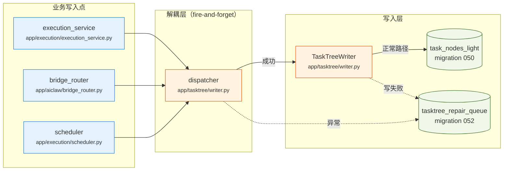
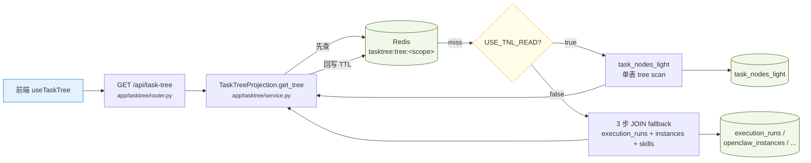
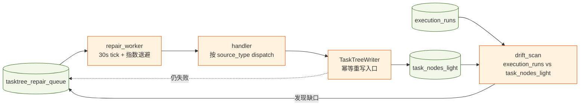

# Task Tree 数据流

> **阅读范围**：本文保留原项目的设计与版本演进记录，不作为公开准备版的安装或验收指南。正文中的“当前／已完成／已上线”须结合当时版本理解；现行可用范围见[能力地图](../public/CAPABILITIES.md)，实测范围见[验证记录](../public/VALIDATION.md)。规范性权限与审核要求不因该说明而放宽。

> 日期：2026-04-14
> 范围：Phase 1.5 + Phase 2 落地后的写入 / 读取 / 补偿三条链路
> 上游设计：`docs/spec/task-tree.md`
> 优化背景：`docs/reviews/2026-04-14-tasktree-optimization-audit.md`

本文只画"生产 + 补偿"三张图并标出源码位置，细节（字段、阈值、运维手册）见引用文档。

---

## 1. 写入数据流

执行链路通过 **fire-and-forget dispatcher** 把写入责任推送给 `TaskTreeWriter`；任何失败都进入 `tasktree_repair_queue` 由 `repair_worker` 异步补齐，主链路永不阻塞。

**关键源码入口：**
- `app/tasktree/writer.py::TaskTreeWriter.create_execution_node / finish_execution_node / sync_instance_heartbeats`
- `app/tasktree/writer.py::enqueue_repair`（写失败 → 入 repair_queue）
- `app/execution/execution_service.py`（Skill 执行成功/失败通知 writer）
- `app/aiclaw/bridge_router.py`（AIClaw 回传节点状态）
- `app/execution/scheduler.py`（心跳 / 状态跃迁）

**设计要点：**
- dispatcher 是 fire-and-forget：写入失败不影响 execution_service 事务提交。
- writer 内所有写操作都包在 `try/except` 内，捕获到异常立刻 `enqueue_repair(payload)`。
- 失败只写指标 `tasktree_writer_failure_total{source=...}`，不抛回调用方。

---

## 2. 读取数据流

读路径由 feature flag `USE_TNL_READ` 控制：默认走 `task_nodes_light` 主路径，异常时可回退到 Phase 1 的 JOIN fallback。所有缓存按 `department + auth_scope` 分域，admin 与普通用户视图互不污染。

**关键源码入口：**
- `app/tasktree/router.py::get_task_tree`（ETag + 304 支持）
- `app/tasktree/service.py::TaskTreeProjection.get_tree`
- `app/tasktree/service.py::_tasktree_cache_scope`（department + auth_scope 分域）
- `app/config.py::USE_TNL_READ`（feature flag）

**设计要点：**
- 缓存 key 固定前缀 `tasktree:tree:<scope>:<status>`，scope 至少包含 `department` + `is_admin` + 用户 id 哈希；详见 `_tasktree_cache_scope`。
- Department 授权判断走 `current_user.department` + 管理员角色矩阵，不接受请求参数原样的 `department`；越权会返回 403 并写审计。
- 前端 `useTaskTree` 使用 ETag，命中 304 跳过 body 解析。
- 前端轮询采用指数退避（空闲延长 TTL）+ 请求去重；详见 `web/src/pages/tasktree/composables/useTaskTree.ts`。

---

## 3. 补偿闭环

`repair_worker` 每 30s 扫一次 `tasktree_repair_queue`，对 pending / retrying 的 payload 调用 writer 的幂等重写入口；`drift_scan` 定期扫 execution_runs 与 task_nodes_light 的缺口并反向入队。

**关键源码入口：**
- `app/tasktree/models.py::TaskTreeRepairQueue`
- `app/tasktree/writer.py::enqueue_repair`
- `app/tasktree/writer.py::_coerce_uuid` 等幂等辅助函数
- `app/tasktree/writer.py` 文件顶部注释说明 repair_worker 约定
- drift_scan 与 repair_worker 的定时任务注册点（见 `app/main.py` lifespan 或 `app/execution/scheduler.py`）

**指标与告警（详见 `deploy/prometheus.tasktree.rules.yml`）：**
- `tasktree_writer_failure_total{source}`：writer 失败计数（失败入队时 +1）
- `tasktree_repair_queue_size`：pending + retrying 条目数
- `tasktree_repair_lag_seconds`：队列最老 pending 等待时长
- `tasktree_drift_gap_total`：最近一次 drift_scan 发现的缺口数

对应告警：TaskTreeWriterFailureRate / TaskTreeRepairQueueStuckWarn / TaskTreeRepairQueueStuckCritical / TaskTreeRepairLagHigh。

---

## 回滚策略

线上出现严重问题时按顺序回滚，尽量保护已写入的数据。

1. **关 feature flag：** `USE_TNL_READ=false`，读路径立即退回 Phase 1 JOIN fallback。写路径仍旧，数据不丢。
2. **停 repair_worker：** 保留队列数据；人工排查 writer 失败原因（通常是 DB schema drift 或外键错位）。避免 worker 在错误状态下继续消费把 repair_queue 拉爆。
3. **Migration 回滚（严格顺序，前置依赖先回）：**
   - `alembic downgrade 051`（回滚 052：`tasktree_repair_queue` 表）——之前 writer 失败直接丢指标而非入库，可接受。
   - `alembic downgrade 050`（回滚 051：`execution_runs.manual_baseline_minutes` / `business_value_tag` / `business_ref_id` 与 `skills.default_baseline_minutes` 字段）——Phase 2 驾驶舱降级，执行链路不受影响。
   - `alembic downgrade 049`（回滚 050：`task_nodes_light` 表本身）——必须同时关闭 writer 写入，否则写失败；此步在上述两步都不够时才用。
   - `alembic downgrade 048`（回滚 049：索引）——仅当怀疑索引引起回归时用。
4. **写入层彻底降级：** 在 `dispatcher` 里加短路开关（env `TASKTREE_WRITE_DISABLED=true`），writer 全部跳过；服务可继续运行，tasktree 展示可能落后。

**回滚前的前置动作：**
- 开启 `tasktree_get_tree_p99_seconds` 观察 5 分钟确认真相。
- 确认 `tasktree_repair_queue_size` 是否仍在增长（如是，先排查 writer）。
- 若仅前端抖动，优先通过 feature flag 切换而不是回滚迁移。

---

## 相关文档

- `docs/spec/task-tree.md`：共识方案（含 2026-04-14 优化增量）
- `docs/plans/2026-04-13-task-tree-implementation-spec.md` / `2026-04-13-task-tree-dev-spec.md`：实施细则
- `docs/next/tasktree-sse-spike.md`：SSE/WS 推送 spike（下一阶段）
- `docs/plans/2026-04-14-tasktree-runbook.md`：运维排障手册
- `docs/reviews/2026-04-14-tasktree-optimization-audit.md`：19 项优化 audit 报告
