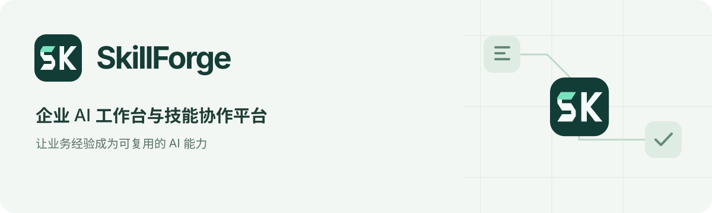

# SkillForge 品牌资源

公开版统一使用 **SkillForge** 名称。图形由连续、咬合的几何模块组成双字母 **SK**，对应业务方法的组合、流转与复用；不使用公司标识、第三方 Agent 标识或字体字形作为图标主体。



## 资源与使用

| 场景 | 资源 |
|---|---|
| 主标识、网页与登录页 | [mark.svg](../../web/public/brand/mark.svg)，Vue 组件 `SfBrand.vue` |
| 单色印刷、遮罩 | [mark-mono.svg](../../web/public/brand/mark-mono.svg)，使用 `currentColor` |
| 浏览器 | SVG favicon、32px PNG、180px Apple Touch Icon |
| Bridge 系统托盘 | 32／64／128／256px PNG，脚本内嵌同源 128px PNG |
| 浏览器扩展 | 16／48／128px PNG |
| README 与展示 | [中文横幅](readme-zh.svg)、[英文横幅](readme-en.svg)、[品牌预览](preview.html) |

主色为深松绿 `#123D37`，强调色为薄荷绿 `#77E3BC`，反白为 `#F4FBF8`。深色底板使图标在浅色与深色系统界面均可识别；状态、错误与警告继续使用原有语义颜色，不用品牌绿替换所有状态。

完整字标最小建议 15px，16px 托盘只用图形，不挤入文字。图形四周至少保留其宽度八分之一的净空；不拉伸、不旋转、不加阴影或装饰性渐变。界面字标使用系统字体，无需下载外部字体。单色符号在深背景上使用白色。

## 重新生成图标

只修改 `web/public/brand/mark.svg`，再生成全部导出。构建脚本需要 Node.js 和 Sharp；以下把工具依赖装在独立临时目录，不改业务依赖：

```bash
npm install --prefix /tmp/skillforge-brand-tools --no-save sharp
NODE_PATH=/tmp/skillforge-brand-tools/node_modules node scripts/render_brand_assets.mjs
git diff --check
```

脚本会更新 favicon、PNG、Bridge 内嵌资源及中英文 README 横幅。单色 SVG 的轮廓应与主标识一致。Bridge 启动时会替换旧图标缓存。改动后检查 16px、32px 和大尺寸显示，以及实际登录页和导航栏。

这是本地品牌改造，不会自动上传或发布 GitHub，也不改变任何业务权限、模型配置或企业集成。

## 界面样式与预览

界面配色由 `web/src/styles/brand-theme.css` 统一提供，兼容原有 `--ai-*`、`--sf-*` 和 Arco 组件。浅色使用中性绿白背景与深绿主操作，暗色使用深绿背景与薄荷绿主操作；成功、警告、失败和信息各自保留语义。新组件应引用这些变量，避免新增固定白底、黑色悬停或页面专属字体。

在 `web/` 中运行 `npm run dev -- --host 127.0.0.1`，打开开发服务器的 `/style-preview.html`。该页面直接使用实际 Arco、品牌、工作台对话和讲解组件，以合成内容检查日间／暗色、弹窗、抽屉、输入焦点和窄屏。它不连接业务后端，也不调用模型；不进入生产构建入口。

本次发现、修改与验证边界见[样式检查记录](STYLE_REVIEW_20260920.md)。

## 本次验证 2026-09-20

- Web 类型检查与生产构建通过。
- 导航、账号状态和工作台定向回归：16 通过、1 个既有跳过项。
- 节点调度与 Bridge 图标缓存回归：61 通过，使用独立临时数据库；没有连接企业节点或调用付费模型。
- 实际浏览器检查：登录页、暗色文字对比度、浅／深色品牌组合、16px 图标及中文 README 横幅。
- SVG 可解析；favicon 与主标识一致，Bridge 内嵌图标与导出 PNG 一致；公开分发检查无发现。

以上为品牌改造范围内的验证，不替代[全量后端尚未通过项](../public/RELEASE_CHECK_20260920.md)。

## English

SkillForge uses a modular geometric **SK** monogram to represent reusable, connected business capabilities. Forest green, mint and an off-white foreground form the identity. SVG is the canonical source; application, extension and Bridge icons are generated consistently without external fonts or third-party logos.

Use the mark alone at small sizes, preserve its aspect ratio and keep clear space. The Vue `SfBrand` component provides the app wordmark in system fonts. Rebuild exports with the command above and verify light/dark backgrounds and small sizes. These local assets do not publish the project or imply production acceptance.
