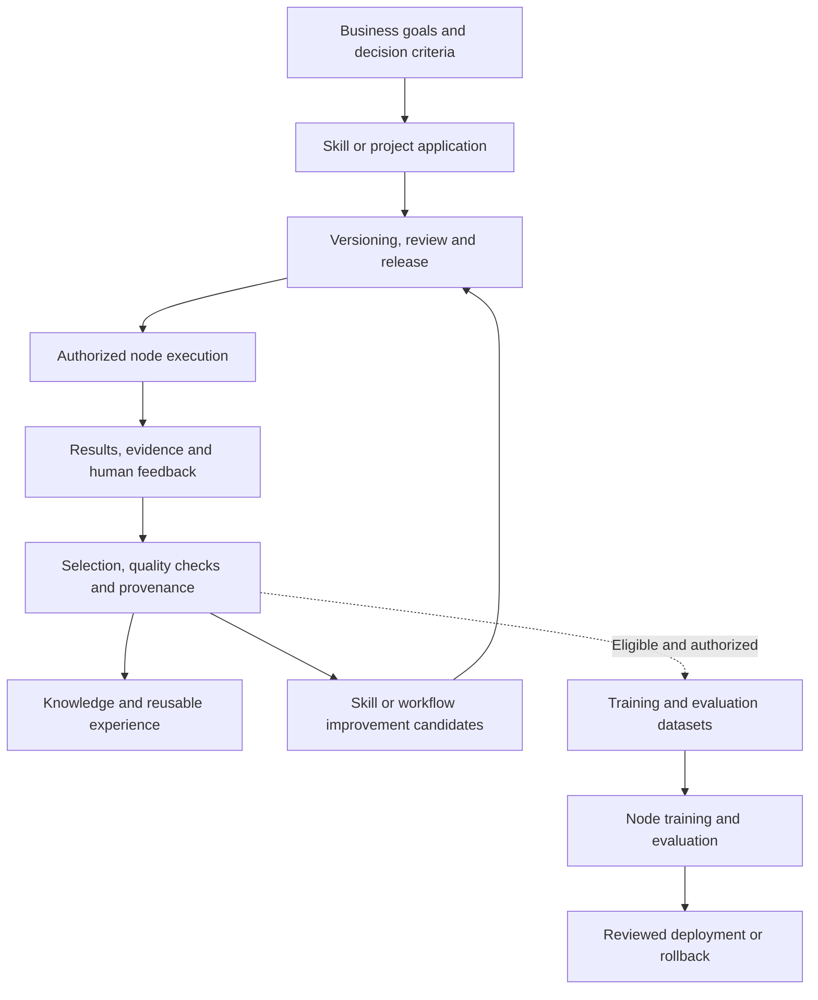
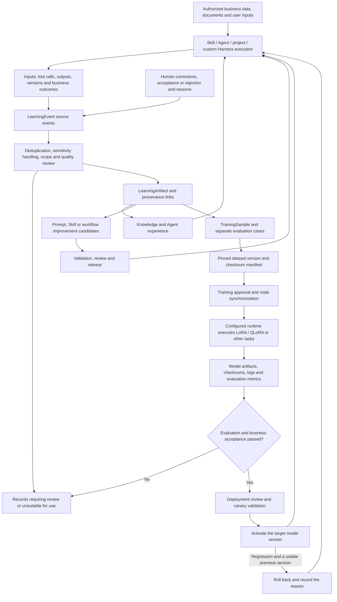

# Business assets, data flow and model training

[中文](DATA_AND_TRAINING.md) · **English** · [Back to README](../../README.en.md)

## What the organization retains after each use

The purpose is to connect results, evidence and feedback to their sources. Suitable material can support knowledge, skill improvements or training preparation. Failures and unknown outcomes should also remain available for review.

| Retained asset | How it can be reused |
|---|---|
| Skills and workflows | Preserve business methods, input/output contracts, tool bindings and traceable versions |
| Prompts and decision criteria | Associate objectives, metric definitions, examples, counterexamples and acceptance criteria with the relevant skill or application version |
| Execution evidence and feedback | Explain how a task was completed, where it failed and which decisions were corrected |
| Knowledge and experience | Supply processed business context for retrieval and future tasks |
| Samples and evaluation sets | Support model comparison or training when provenance, permissions and quality are sufficient |

Three different improvements are involved: **updating knowledge** supplies better context; **improving a skill or workflow** changes rules, tools or steps; **training a model** changes model parameters under a defined objective, dataset and compute setup.

Assets also need owners, allowed scope, effective versions, provenance and acceptance evidence. Logs should distinguish real execution from simulation, inference from confirmation and outputs from actual outcomes, with sensitivity and retention handling. Organizational controls, skill access, data governance, audit and usage records provide foundations; verify permission enforcement and evidence completeness for every integration path.

The code includes learning events, artifacts and provenance links, along with dataset versioning, training jobs, evaluation and deployment management. Actual training requires separately configured models, nodes and data. Automatic training and deployment approval are disabled by default in this edition. Knowledge ingestion, sample generation or job creation alone does not prove successful training or improved performance.

## How data flows and models are trained

**The complete lifecycle is: business execution produces data → governance and review → traceable assets → knowledge, workflow or model improvements chosen for the problem → validation and reuse in business.** Model training is one branch. SkillForge manages provenance, dataset versions, training jobs and deployment states; configured training runtimes perform parameter updates.

### From business inputs to the next execution

The diagram shows the main objects and execution stages represented in the code. Arrows describe transitions subject to configuration, permissions and review. They do not mean every run automatically completes every stage.

### Inputs, outputs and records at each stage

| Stage | How data changes | Records and checkpoints |
|---|---|---|
| 1. Ingestion and execution | Authorized inputs enter a skill, project or Harness, which invokes models and tools for the task | Run ID, sources, inputs, tool calls and outputs, plus applicable skill and model versions |
| 2. Experience capture | Execution, project inputs and outputs, tool calls and human handling outcomes become learning events | `LearningEvent` preserves source type, source ID, hash, department and run relationships; unconnected or unreported data is not inferred |
| 3. Governance and extraction | Handle sensitive fields, deduplicate by source and content, and extract knowledge, experience, samples or improvement candidates | `LearningArtifact` stores type, quality information, sensitivity and processing state; `LearningFlowEdge` connects sources to downstream objects |
| 4. Sample creation | Assemble suitable inputs, context and target outputs into training samples; failures, corrections and exceptions can become evaluation cases | `TrainingAssetSource` and `TrainingSample` retain sources, content hashes, labels and organizational scope; model-generated content still needs quality review |
| 5. Dataset versioning | Select samples and create a specific version with media references, sample lists and checksums | `TrainingDatasetVersion`, manifest and SHA-256; text training packages support train / eval distinctions, while acceptance must also check for leakage between related sources |
| 6. Approval and training | Specify the objective, base model, dataset version, parameters, evaluation gates and target node; dispatch after approval | `TrainingJob`, `TrainingJobTask`, node status and training logs; successful data synchronization is tracked separately from training completion |
| 7. Collection and evaluation | Collect artifacts, metrics and checksums, then check the configured evaluation conditions | Model or adapter artifacts, evaluation results and failure stage; compare against the original model and human business criteria as well |
| 8. Deployment and rollback | Request deployment, review, validate a canary and activate; withdraw regressions and restore a previous version when available | `TrainingModelDeployment`, target skills, runtime, rollout scope, review and rollback records |
| 9. Further learning | Later business runs use the selected version, and new outcomes and corrections re-enter the learning flow | Link deployed versions to actual task outcomes to support the next evidence-based improvement |

### What to train and how to judge it

Private small models can initially target **well-defined, verifiable and frequently repeated** business capabilities. The following are sample-design examples, not industry models already delivered by this repository:

| Target capability | What the samples should contain | Acceptance focus |
|---|---|---|
| Business classification and extraction | Redacted inputs, field definitions and confirmed classifications or structured outputs | Classification accuracy, field accuracy and handling of missing information |
| Business reports and decision explanations | Metric definitions, necessary context, evidence and expert-corrected conclusions | Factual and numerical consistency, evidence references, exceptions and uncertainty |
| Tool selection and step planning | Tasks, permitted tools, valid invocation steps, failures and corrections | Parameter correctness, access boundaries, task completion and recovery |

Strong models can help draft examples, organize cases or suggest labels. Business experts and evaluation processes verify them before dataset selection. Frequently changing facts should first be considered for retrieval or data-tool access; stable business conventions may also be addressed through prompt or workflow changes.

The repository includes training-gateway calls and some local LoRA training runners. **Current local evaluation includes generation checks on a small set of held-out samples. This is basic validation, not a comprehensive business benchmark or proof of generalization.** Before deployment, add independent test sets, comparisons with the original model, business review and cost measurement. Retain failed artifacts for diagnosis; the end of a training process does not establish an improvement.

### Where data lives and how a custom Harness connects

| Data | Storage or execution location | How it moves |
|---|---|---|
| Skill code, workflows and versioned prompts | Separate Skill Git repository or project source | Pin a reviewed version and release it to authorized execution environments |
| Run records, learning events, samples and dataset metadata | Platform database | Connect through source IDs, run IDs, hashes and provenance edges |
| Documents, media, data files and model artifacts | Configured storage or runtime nodes | Retain controlled references, manifests and checksums; synchronize to target nodes as required, with file handling determined by the integration |
| Parameter training and model inference | Configured training / inference runtimes | The platform dispatches tasks and collects status, metrics and artifact references |
| Credentials | Controlled configuration on the relevant server or node | Exclude them from training samples, prompts and shared logs |

A custom Harness can create runs, submit inputs, invoke authorized capabilities and return outputs through Project SDK/API interfaces. The interfaces also provide training-source synchronization, sample creation, dataset version creation and synchronization. Integrations should associate project, run, skill version, applicable model version, business outcomes and human corrections. Returning only a final answer leaves out evidence needed to diagnose failures and build reliable samples. Unreported local steps are not platform-observed data.

Automatic training, automatic training dispatch and automatic deployment approval are disabled by default in this edition. Learning-event capture and model-parameter training have separate controls. This lifecycle requires authorized data, sample rules, a trainable model, compute, evaluation criteria and an inference environment. Existing sensitive-field handling and organizational scope checks still need validation against the organization's data; they do not guarantee automatic redaction of every data type.

Code evidence: [learning events and relationships](../../app/learning/models.py), [extraction and routing](../../app/learning/service.py), [training assets and deployment models](../../app/training/models.py), [training and deployment services](../../app/training/service.py), [Bridge training runners](../../bridge/skillforgebridge.py) and [runtime model selection](../../app/execution/model_context.py). See the [validation record](../../docs/public/VALIDATION.md) for the limits of actual external training and production verification.
