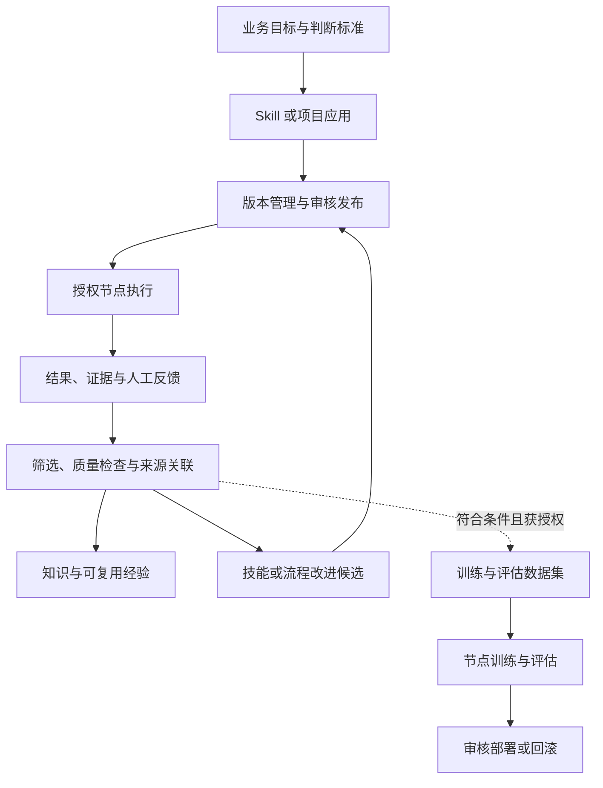
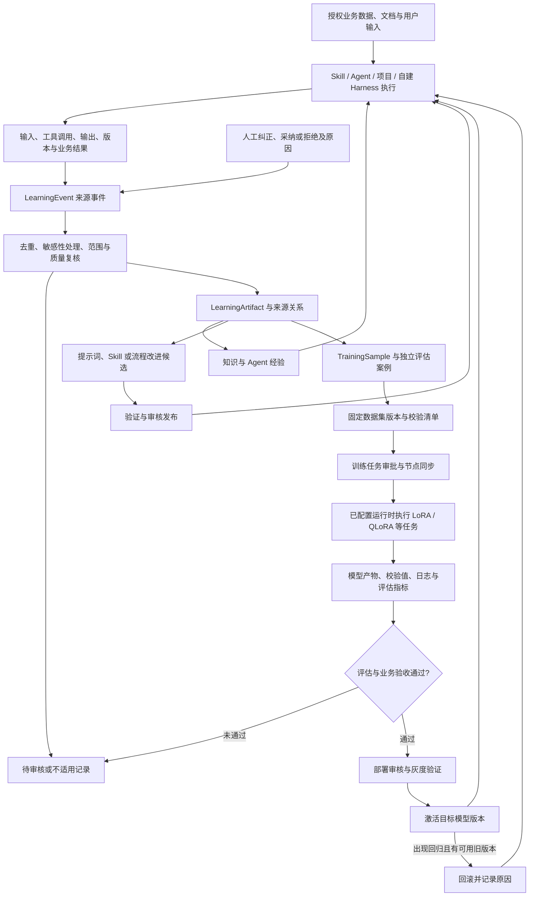

# 业务资产、数据流与模型训练

**中文** · [English](DATA_AND_TRAINING.en.md) · [返回 README](../../README.md)

## 每次使用之后，企业留下什么

流程的重点是让结果、证据和人工反馈有来源关系。合格的内容可以进入知识、技能改进或训练准备；失败和未知结果也应保留，供复核使用。

| 积累的资产 | 可以怎样复用 |
|---|---|
| 技能与流程 | 保存业务方法、输入输出约定、工具绑定和可回溯版本 |
| 提示词与判断标准 | 将任务目标、业务口径、正反例与验收条件绑定到相应技能或应用版本 |
| 执行证据与反馈 | 解释某次任务如何完成、哪里失败、哪些判断被纠正 |
| 知识与经验 | 为检索和后续任务提供经过处理的业务上下文 |
| 样本与评估集 | 在来源、权限和质量满足要求时，用于比较或训练模型 |

这里有三种不同的改进：**更新知识**，帮助任务取得正确上下文；**改进技能或流程**，调整规则、工具和步骤；**训练模型**，在明确目标、数据和计算条件下优化模型参数。

资产还需要负责人、使用范围、生效版本、来源和验收依据。日志应区分真实执行与模拟、推断与确认、输出与实际结果，并按敏感性和保留期限处理。平台有组织、技能权限、数据治理、审计和用量记录基础，仍需对每条接入路径核验权限和证据是否完整。

代码包含学习事件、产物与来源关联，以及数据集版本、训练任务、评估和部署管理。实际训练需要单独配置模型、节点和数据，公开版默认关闭自动训练与部署审批。知识入库、样本生成或任务创建，都不能单独作为训练成功或效果提升的证明。

## 数据如何流转，模型如何训练

**完整链路是：业务运行产生数据 → 治理和复核 → 形成可追溯资产 → 按问题选择知识、流程或模型改进 → 验证后再次用于业务。** 模型训练是其中一条分支。SkillForge 管理数据来源、数据集版本、训练任务与部署状态；参数更新由配置好的训练运行时执行。

### 从业务输入到再次运行

下图包含现有代码中的主要对象和执行环节。箭头表示受配置、权限和审核约束的流转；不表示每次运行都会自动走完全部步骤。

### 每一步输入什么、留下什么

| 阶段 | 数据如何变化 | 留下的记录与检查点 |
|---|---|---|
| 1. 接入与执行 | 授权输入进入技能、项目或 Harness，按任务调用模型和工具 | 运行 ID、来源、输入、工具调用与输出；记录适用的技能和模型版本 |
| 2. 捕获经验 | 执行、项目输入输出、工具调用及人工处理结果转为学习事件 | `LearningEvent` 保留来源类型、来源 ID、哈希、部门及运行关联；未接入或未回传的数据不会凭空出现 |
| 3. 治理与提取 | 处理敏感字段，按来源与内容去重，提取知识、经验、样本或改进候选 | `LearningArtifact` 保存类型、质量信息、敏感级别和处理状态；`LearningFlowEdge` 连接来源与下游对象 |
| 4. 建立样本 | 将符合用途的输入、上下文与目标输出整理为训练样本；错误、纠正与例外可以成为评估案例 | `TrainingAssetSource`、`TrainingSample` 记录来源、内容哈希、标签和组织范围；模型生成内容仍需质量复核 |
| 5. 固定数据集 | 选择样本并生成特定版本，记录媒体引用、样本清单与校验值 | `TrainingDatasetVersion`、manifest 与 SHA-256；文本训练包支持 train / eval 区分，验收时还需检查同源泄漏 |
| 6. 审批与训练 | 明确目标、基座模型、数据版本、参数、评估门槛与目标节点；审批后派发 | `TrainingJob`、`TrainingJobTask`、节点状态、训练日志；同步数据成功与训练完成分别记录 |
| 7. 回收与评估 | 回收训练产物、指标和校验值，按任务配置检查评估条件 | 模型或适配器产物、评估结果与失败阶段；还需与原模型、人工业务标准对照 |
| 8. 部署与回滚 | 创建部署申请，审核后灰度，验证后激活；出现回归时撤回并在可用时恢复旧版本 | `TrainingModelDeployment`、目标技能、运行时、灰度范围、审核及回滚记录 |
| 9. 再次积累 | 后续业务运行使用选定版本，新结果与纠正继续进入学习链路 | 将部署版本与真实任务结果关联，形成下一轮有来源的改进依据 |

### 训练什么，以及如何判断有效

企业小模型可以先围绕**任务明确、结果可判断、重复频率高**的业务能力训练。以下是样本设计示例，不是已经交付的行业模型：

| 目标能力 | 样本应包含什么 | 验收重点 |
|---|---|---|
| 业务分类与信息提取 | 脱敏输入、字段定义、经确认的分类或结构化结果 | 分类正确率、字段准确性、缺失信息处理 |
| 业务报告与判断表达 | 指标口径、必要上下文、证据、专家修正后的结论 | 事实与数字一致性、证据引用、例外与不确定性表达 |
| 工具选择与步骤规划 | 任务、允许的工具、合格调用步骤、失败与纠正案例 | 参数正确性、权限边界、任务完成与恢复能力 |

强模型可以辅助生成初稿、整理案例或提出标注建议，业务专家和评估流程负责核验后再选入数据集。训练更新频繁的事实前，应先考虑知识检索与数据工具；固定业务口径也可能通过提示词或工作流调整解决。

仓库包含训练网关调用和部分本地 LoRA 训练运行器。**当前本地评估包含小规模留出样本的生成检查，属于基础验证，不能代替完整业务基准或证明泛化能力。** 上线前应补充独立测试集、原模型对照、业务复核和成本测量。失败产物保留用于诊断，不因训练进程结束就宣布效果提升。

### 数据在哪里，自建 Harness 如何接入

| 数据 | 保存或执行位置 | 流转方式 |
|---|---|---|
| 技能代码、工作流及随版本管理的提示词 | 独立 Skill Git 仓库或项目源码 | 审核后固定版本，发布到授权执行环境 |
| 运行记录、学习事件、样本与数据集元信息 | 平台数据库 | 通过来源 ID、运行 ID、哈希与关联边连接 |
| 文档、媒体、数据文件与模型产物 | 配置的存储位置或运行节点 | 保存受控引用、清单与校验值；按任务向目标节点同步，具体文件策略由接入实现决定 |
| 参数训练与模型推理 | 配置好的训练／推理运行时 | 平台派发任务并回收状态、指标与产物引用 |
| 凭据 | 对应服务端或节点的受控配置 | 不作为训练样本、提示词或共享日志内容传递 |

自建 Harness 可以通过 Project SDK/API 创建运行、提交输入、调用授权能力和回传输出；接口也提供训练来源同步、样本创建及数据集版本创建与同步。接入时应关联项目、运行、技能版本、适用的模型版本、业务结果和人工纠正。只回传最终一段回答，会缺少分析失败和构建可靠样本所需的依据；未回传的本地过程也不属于平台已观测数据。

公开版默认关闭自动训练、自动训练派发和自动部署批准；学习事件采集与模型参数训练是不同开关。使用这条链路需要配置授权数据、样本规则、可训练的模型、算力、评估标准和推理环境。现有敏感字段处理与组织范围检查仍需结合企业数据进行验收，不能视为所有类型数据都已自动脱敏。

代码依据：[学习事件与关联](../../app/learning/models.py)、[提取和流转](../../app/learning/service.py)、[训练资产与部署模型](../../app/training/models.py)、[训练与部署服务](../../app/training/service.py)、[Bridge 训练运行器](../../bridge/skillforgebridge.py)、[执行时模型选择](../../app/execution/model_context.py)。真实外部训练与生产部署的验证范围见[验证记录](../../docs/public/VALIDATION.md)。
