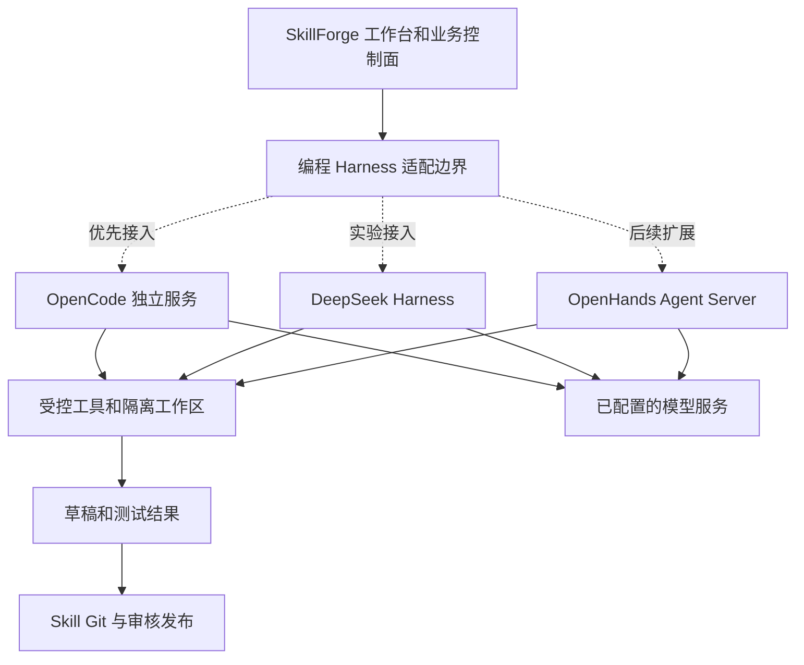

# 编程 Harness 替换评估与清理记录

[English](HARNESS_REPLACEMENT.en.md) · 核查日期：2026-09-20

## 结论

**优先接入 OpenCode Server；DeepSeek Harness 作为实验适配器；OpenHands SDK 留作远程沙箱方案。**
这是结合本项目调用链作出的工程建议，不是三者性能排名，也不表示已完成接入。
本次完成旧运行时退出和选型；新适配器尚未验收，编程会话保持不可用。

原项目以 `aiclawcode` 标识旧编程运行时。
它与执行节点的 **AIClaw / OpenClaw / Bridge** 不同，后者不在本次删除范围。

## 为什么这样选择

SkillForge 已有 Vue 工作台、FastAPI、会话事件、权限规则、MCP 定义、Git 和审核。
当前缺的是可以替换的代码执行引擎；再引入一套完整企业管理界面会重复平台职责。

| 候选 | 官方能力与许可 | 对 SkillForge 的适配判断 | 本轮状态 |
|---|---|---|---|
| **OpenCode** | MIT；HTTP/OpenAPI、SSE、会话取消及权限响应；支持 DeepSeek 与自定义模型服务 | 独立服务较容易替换旧 stdio 边界；沿用我们的界面与业务审核。需要新增事件、权限和工作区适配 | **优先候选**，未安装或接入 |
| **DeepSeek Harness** | MIT；插件架构、Python SDK、多种模型 API 协议；官方标注 developer preview | 适合深度定制 Harness。版本变化、默认 profile、日志出口需单独验证 | **实验候选**，已读源码与官方资料，未运行 |
| **OpenHands Software Agent SDK** | MIT；Python Agent/Conversation、工具及远程 Agent Server | 适合后续隔离沙箱和后台批处理；需要适配其事件和会话模型 | **备选**，未安装或接入 |

依据：[OpenCode 服务接口](https://opencode.ai/docs/server/)、[模型服务](https://opencode.ai/docs/providers/)、[许可证](https://github.com/anomalyco/opencode/blob/dev/LICENSE)；[DeepSeek Harness](https://github.com/deepseek-ai/deepseek-harness)、[Python SDK](https://github.com/deepseek-ai/deepseek-harness/blob/master/docs/user/guide/python-sdk.md)、[模型配置](https://github.com/deepseek-ai/deepseek-harness/blob/master/docs/user/guide/providers.md)；[OpenHands SDK 架构](https://docs.openhands.dev/sdk/arch/overview)、[许可证](https://github.com/OpenHands/software-agent-sdk/blob/main/LICENSE)。

以上“优先／实验／备选”是本项目的选择，不是上游承诺。MIT 仅描述所查组件的许可证，不代表本项目或所有传递依赖已获得公开发布授权。

### DeepSeek Harness 需要特别处理的地方

核对官方源码提交 `ddefc45fbc7f8e46dd73185e68295696d1297887`：

- 官方明确说明仍为开发预览，尚未经过安全审计，不能视作生产就绪。[安全说明](https://github.com/deepseek-ai/deepseek-harness/blob/ddefc45fbc7f8e46dd73185e68295696d1297887/SAFETY.md)
- `sdk-minimal` 示例固定使用 `danger-full-access`；工作目录不是文件访问的隔离边界。
- 该示例默认启用 DeepSeek 会话日志贡献插件，随请求上传尚未被接收的日志后缀；企业适配应显式关闭 `session-log-deepseek.enabled`，并验证实际网络行为。
- 上述默认行为指该提交的 **最小 SDK profile**，不能外推为所有 profile 的行为。[版本固定的 SDK 文档](https://github.com/deepseek-ai/deepseek-harness/blob/ddefc45fbc7f8e46dd73185e68295696d1297887/docs/user/guide/python-sdk.md)

因此，不能直接照抄最小示例接入企业目录。试点时锁定版本、使用独立容器与 home、显式选择插件和权限，验证日志只进入允许的存储。日志插件关闭也不代表模型请求不含业务上下文；两种数据出口分别管理。

## 三层职责，避免再次绑定某个模型或 fork

图中虚线均为待实现接入，现有 SkillForge 审核与版本链路继续保留。

1. **SkillForge 自建控制层**：身份与部门权限、上下文挑选、工具授权、Skill 版本、审核、评估、预算和审计由平台掌握。
2. **第三方 Harness**：负责模型与工具循环、执行状态、可取消会话和执行环境，输出统一事件和产物。
3. **模型服务**：DeepSeek 官方、兼容网关或本地模型是可配置后端，与 Harness 独立选择。网关与具体模型需要实测工具调用、流式事件、思考参数和 token 计量，不能仅凭“兼容”宣称可用。

自建 Harness 的价值在业务治理与可积累资产，没必要复制维护整个第三方 CLI 源码。
运行时选择不等于训练能力：经授权的事件经脱敏、结果验证和审核后才进入样本、评测集或训练流程。
原始日志不直接作为训练真值；保留 Skill commit、提示词版本、模型版本、工具参数摘要、结果与人工修正之间的关联。

## 本次实际清理

| 对象 | 处理 |
|---|---|
| 原先受限的 vendor 源码与产物 | 公开版初始导出时已排除；本次没有重新引入 |
| CLI 启动器 | 删除 Node 路径与专用启动参数；`start()` 明确拒绝启动 |
| 配置与自检 | 移除 `CODING_AGENT_DIST_PATH`、`CODING_AGENT_NODE_BIN`；旧启用配置不能启动进程或阻止整个控制面启动 |
| 旧专用代理 | 删除内嵌上游代理、GLM 协议转换脚本及路由注册 |
| 旧探测脚本 | 删除 `_probe_coding_agent.py`、`benchmark_coding_agent.py`、`e2e_coding_agent_30rounds.py` |
| 连接与 MCP 测试入口 | 返回“替代运行时待接入”，不取模型凭据、不拉起旧运行时、不调用模型 |
| 自动创建 Skill | 运行时缺失时立即结束；不删除草稿，不为该错误重试 |
| 设置页 | 移除旧运行时启用表单，展示可用边界与接入状态 |
| 过时文档 | 替换“继续以旧运行时为默认”的建议，删除旧专属集成分析 |

**有意保留**：平台侧 `session_service`、权限与 MCP 配置、历史事件解析、草稿与验证契约、数据库历史字段。
这些不是可运行的新适配器；部分仍使用旧协议术语，供历史数据和既有回归使用。新适配器不得通过恢复旧启动参数来“接通”。
设计参考与来源说明保留供权属审查，不能通过删掉原作者或参考来源来声称完成许可证清理。
原私有项目、节点执行、普通模型封装以及 Skill 审核状态机没有迁移到第三方运行时。

## 下一步的接入契约

建议新建 `CodingAgentAdapter`，不把 OpenCode 参数散落到业务路由：

| 接口职责 | 平台要求 |
|---|---|
| `capabilities / health` | 返回版本、支持的工具审批、取消、恢复与用量能力；不支持的能力明确报告 |
| `create_session / send_turn` | 绑定用户、Skill、Git commit、提示词版本、模型配置版本与幂等键 |
| `events` | 转为现有文本、工具调用、工具结果、权限请求、文件变化、用量、结束和错误事件 |
| `approve_tool` | 绑定会话、工具调用 ID 和参数哈希；参数变化后旧授权失效 |
| `cancel / close` | 有界等待，执行端确认停止；界面关闭不等于后台已取消 |
| `resume` | 回读已存在会话和步骤，重连不能重复执行工具；旧会话不保证可跨引擎恢复 |
| `artifacts / usage` | 文件变化与测试证据回平台；日志脱敏，不记录密钥；费用来源与估算分开 |

OpenCode 服务必须仅由后端访问，配置鉴权，并按授权范围隔离进程/容器、home 和工作区；一个共享服务密码不能代替 SkillForge 多用户权限。
首批只挂载指定 Skill 草稿目录，不挂整个服务器目录。MCP 按当前用户权限下发，发布、通知等副作用仍走平台授权。
不照搬旧创建流程中的 `bypassPermissions`；路径检查也不能替代 OS 或容器隔离。

## 启用门槛

- 锁定依赖版本、检查许可与传递依赖；干净目录可重建，不携带企业文件或默认密钥。
- 验证普通模型回复和至少一次真实工具调用，拒绝工具后不能执行；审批失效和越权均可观察。
- 验证双用户隔离、取消、超时、断线恢复、服务崩溃、任务幂等和无重复副作用。
- 验证创建 Skill → 生成契约与代码 → 测试 → diff → Git 保存 → 人工审核；不能绕过发布门禁。
- 校验事件日志可追溯但不携带密钥；样本进入训练前经过脱敏和人工确认。
- 完成实际网关和模型验收后才开放启用。当前只有清理回归与资料评估，没有第三方运行时或真实模型联调结果。

测试记录见 [VALIDATION.md](VALIDATION.md)。
