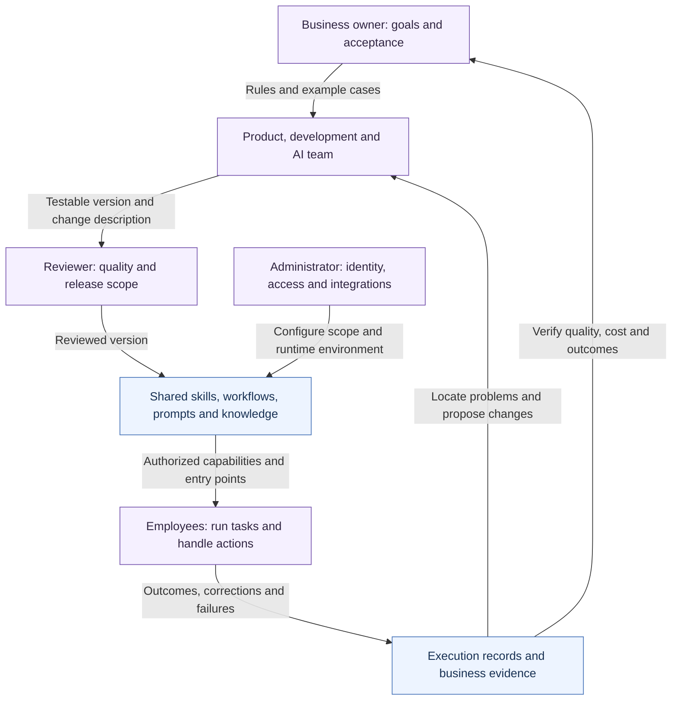
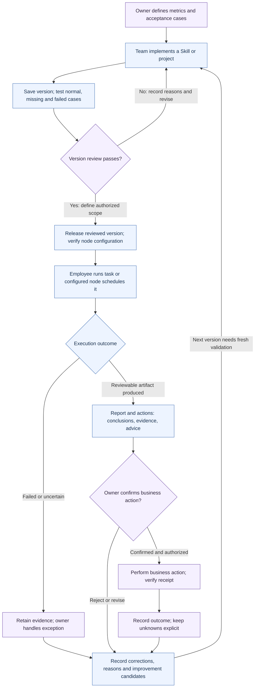
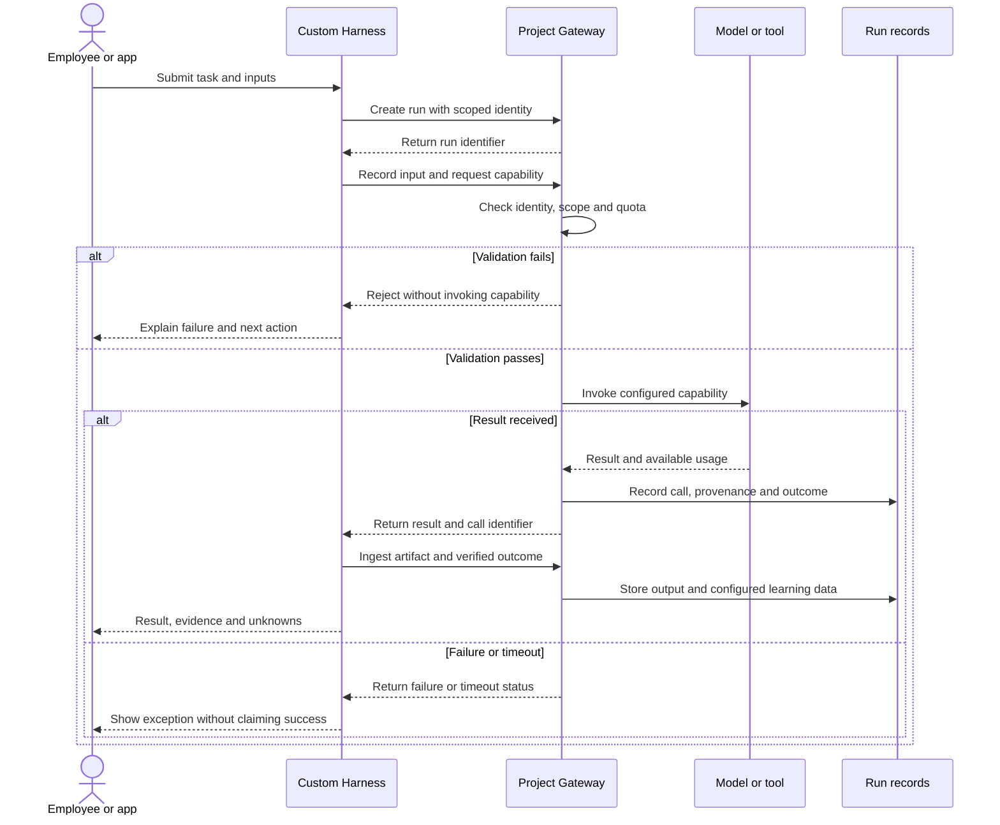
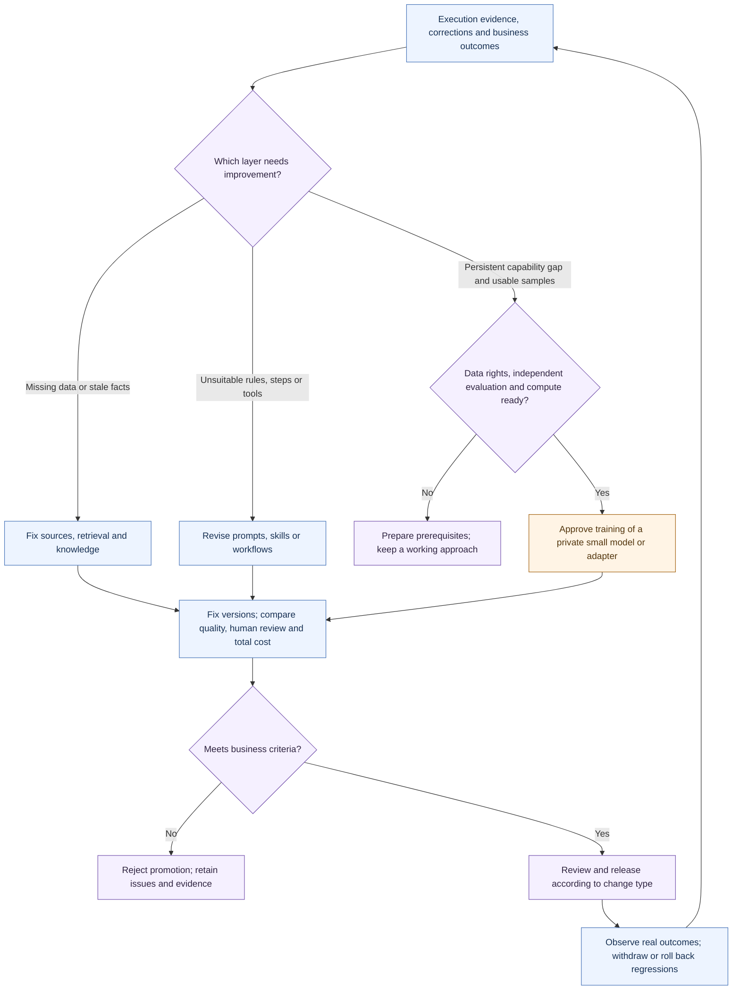

# How an enterprise operates with SkillForge

[中文](OPERATING_MODEL.md) · **English** · [Back to README](../../README.en.md)

These diagrams explain ownership, business handoffs, one runtime integration and how experience informs improvements. Organization and delivery diagrams describe a suggested operating model; the runtime diagram uses existing interfaces; the improvement diagram is a decision method. None represents full production acceptance. See the [capability map](CAPABILITIES.en.md) and [validation record](VALIDATION.md).

Blue identifies platform components or assets, purple identifies human responsibilities, and orange identifies external capabilities requiring configuration or adaptation. Colors classify responsibilities, not implementation status. Each diagram includes a text alternative and an SVG version.

## 1. Organization: business owns outcomes, the platform retains methods

This is a responsibility diagram, not an actual company's reporting hierarchy or an automatic mapping to application roles and permissions. One person may hold several responsibilities; review, authorization and outcome ownership must still be explicit.

[Open standalone SVG](diagrams/organization.en.svg)

**Text path:** the business owner defines standards → the delivery team implements → a reviewer approves the version → employees use authorized capabilities → feedback and verified outcomes return to the owner and builders. Administrators configure access and infrastructure; business owners assess value.

| Handoff | Retained information | Acceptance |
|---|---|---|
| Business → builders | Goals, definitions, sources, exceptions and confirmation boundaries | Both sides can judge the same examples |
| Builders → reviewers | Fixed version, tests, permissions and change description | Review passes and release scope is explicit |
| Platform → employees | Visible capabilities, versions, input instructions and exception handling | Verified execution in an authorized environment |
| Employees → business owner | Artifacts, corrections, actions, outcomes or reasons for uncertainty | Owner verifies business completion |

## 2. Delivery: generated output is distinct from completed business work

This synthetic example uses operational anomaly analysis. Connections represent handoffs. Data, the specific Skill, notifications and business actions require configuration; this is not a bundled, ready-to-run business integration.

[Open standalone SVG](diagrams/delivery.en.svg)

**Text path:** goal → implementation and tests → review and release → execution → human review → actual action → verified outcome. Failure, rejection and uncertainty have separate exits feeding subsequent improvement.

Track three distinct states: **asset release, task execution and verified business outcome**. The labels are not database status enums, and they do not imply that every notification channel supplies read receipts. Without evidence, business completion must not be inferred.

Implementation references: [Skill lifecycle](../../app/skills/lifecycle/), [execution records](../../app/execution/models.py), [project service](../../app/projects/service.py), [business handoffs](CAPABILITIES.en.md).

## 3. Runtime: integrating a custom Harness

This sequence describes a recommended first **read-only Project SDK task**, not every Skill's execution path. SDK/API foundations exist; the integrator implements Harness context management, adaptation and recovery. Models and tools require configuration and authorization.

[Open standalone SVG](diagrams/runtime.en.svg)

**Text path:** business input → Harness → project authorization and capability checks → model or tool → execution records → artifact ingestion. Local Harness steps that are not reported are not platform-observed data. Credentials do not belong in shared logs or prompts.

- Writes, notifications and other external actions follow their specific tool authorization and confirmation rules. This read-only example grants no write authority; verify uncertain outcomes before deciding whether to retry.
- Node scheduling is a separate path: platform reviews versions and distributes configuration → compatible Bridge node executes → status and results return. Nodes are the primary scheduler; the platform retains fallback compensation.
- The retired Workbench coding runtime is not part of this sequence. OpenCode / DeepSeek Harness remain candidates, not integrated replacements.
- Project sample sinks and automatic training use separate settings, and a legacy sink fallback remains. Review [SDK data handling](../guides/project-gateway-sdk.md) before supplying business data.

Code references: [SDK](../../sdk/), [Project API](../../app/projects/router.py), [Bridge](../../bridge/README.md), [Harness replacement status](HARNESS_REPLACEMENT.en.md).

## 4. Improvement: identify which layer needs to change

This is a human or team review method, **not an implemented automatic diagnosis or model router**. A problem can require several branches. Correct sources, permissions and evaluation standards before deciding to train.

[Open standalone SVG](diagrams/improvement.en.svg)

**Text path:** verify the problem → choose knowledge, workflow or model improvement → evaluate against a baseline → review → observe outcomes. Knowledge and workflow changes do not update model parameters; training changes weights or adapters.

Strong models may help with planning, candidates and failure analysis. Private small models can serve evaluated, stable tasks. Switching requires evidence about quality, latency, maintenance and total cost, not model size or price alone. Keep related-source data out of independent evaluation splits; unreviewed model output is not a ground-truth label.

The complete data-object, storage, training-approval, evaluation, deployment and rollback diagram remains in the [README training flow](../../README.en.md#training), avoiding a second independently maintained data flow. See the [capability map](CAPABILITIES.en.md) for current training and optimizer limitations.

## Maintaining these diagrams

The Mermaid blocks on this page are the editable sources; `diagrams/*.svg` are static copies for readers without Mermaid support. Regenerate both languages when editing and validate syntax, readable text and local links. Do not add real company personnel, addresses, business data, credentials or unverified outcome claims.
