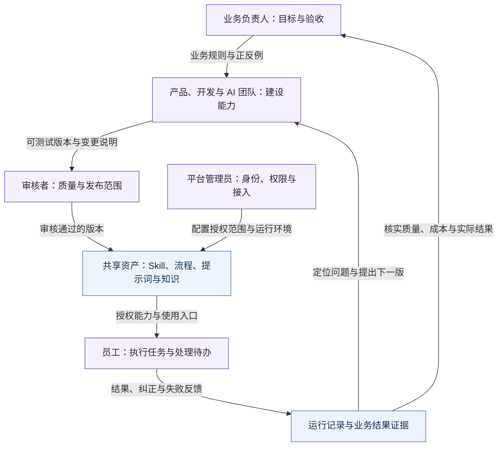
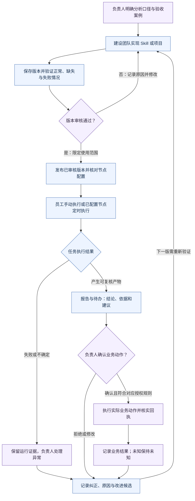
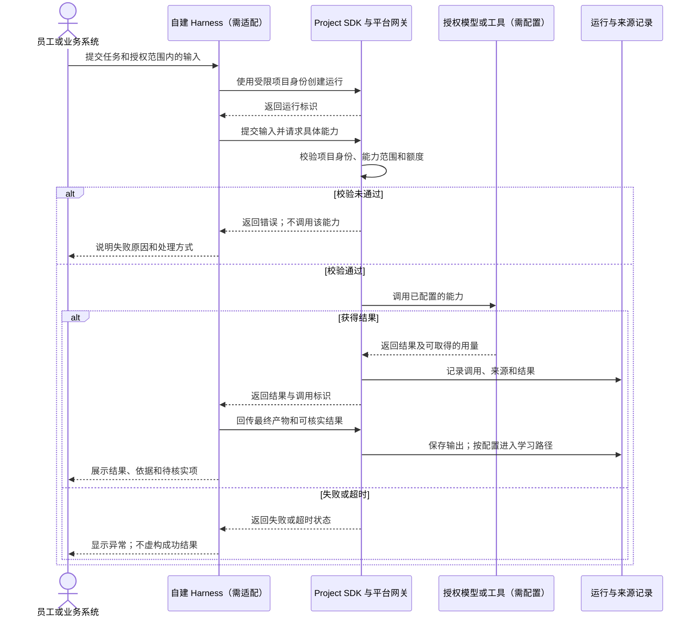
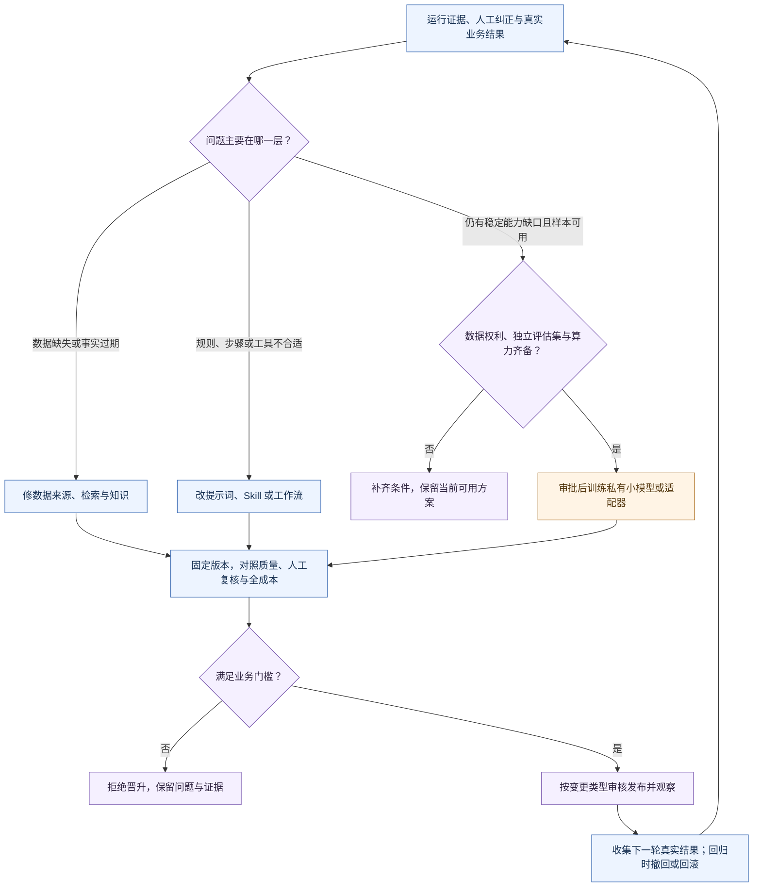

# 企业如何使用和运行 SkillForge

**中文** · [English](OPERATING_MODEL.en.md) · [返回 README](../../README.md)

这组图回答四个问题：谁负责、工作如何交接、一次任务怎样运行，以及经验如何改进下一次工作。组织与交付图是建议的企业运行方式；运行图基于现有接口；改进图是选型方法。它们都不代表整条链路已完成生产验收，具体状态见[能力地图](CAPABILITIES.md)和[验证记录](VALIDATION.md)。

图中的蓝色表示平台或资产，紫色表示人工职责，橙色表示需配置或适配的外部能力。颜色只帮助分类，不表示功能完成程度。箭头有文字说明；每张图也提供文字阅读路径和 SVG 版本。

## 1. 组织运行：业务负责结果，平台承载方法

这是职责协作图，不是真实企业组织架构，也不是系统角色或权限的自动映射。小团队可由同一人承担多项职责；审核、授权和业务结果仍需分别明确负责人。

[查看独立 SVG](diagrams/organization.zh.svg)

**文字路径：**业务负责人给标准 → 产品与开发团队实现 → 审核者确认版本 → 员工在授权范围使用 → 反馈和实际结果回到负责人及建设团队。管理员配置身份和环境，不代替业务负责人判断收益。

| 交接 | 应留下的内容 | 完成判断 |
|---|---|---|
| 业务 → 建设 | 目标、口径、输入来源、例外、人工确认边界 | 双方能用同一组案例判断对错 |
| 建设 → 审核 | 固定版本、测试结果、权限及变更说明 | 审核通过且发布范围明确 |
| 平台 → 使用者 | 可见能力、版本、输入说明及异常处理入口 | 在已授权环境中验证可运行 |
| 使用者 → 业务负责人 | 产物、纠正、采取的动作、真实结果或未知原因 | 由负责人核实业务是否完成 |

## 2. 业务交付：把“生成了”与“完成了”分开

下面使用“经营异常分析”作为合成场景。每条连接代表交接要求；数据、具体 Skill、通知和业务动作需要部署者配置，并非安装即用的内置演示。

[查看独立 SVG](diagrams/delivery.zh.svg)

**文字路径：**目标 → 实现与测试 → 审核发布 → 执行 → 人工复核 → 实际动作 → 结果核实。失败、拒绝和未知有独立出口，再进入下一版改进。

需要分别查看三种状态：**资产版本是否发布、任务是否执行成功、业务结果是否核实**。这里不是数据库状态枚举，也不意味着所有通知渠道都有已读回执。无依据时不能把业务结果自动标为完成。

对应实现：[Skill 生命周期](../../app/skills/lifecycle/)、[执行记录](../../app/execution/models.py)、[项目服务](../../app/projects/service.py)、[业务交付说明](CAPABILITIES.md#3-一条业务流程怎样交付)。

## 3. 运行关系：自建 Harness 怎样接入

这是一条建议先验收的**只读 Project SDK 任务**，不是所有 Skill 的执行时序。SDK/API 已有实现；企业自建 Harness 的上下文管理、适配和异常恢复需要接入方完成。模型与工具必须先配置和授权。

[查看独立 SVG](diagrams/runtime.zh.svg)

**文字路径：**业务输入 → Harness → 项目授权与能力检查 → 模型或工具 → 运行记录 → 产物回传。未回传的 Harness 本地过程不属于平台已观测数据；日志和提示词不应包含凭据。

- 写入、通知和其他外部动作要遵守对应工具的授权与确认规则。本图只读路径不能据此获得写入授权；结果不确定时先核实，再决定是否重试。
- 节点定时执行是另一条路径：平台审核版本与下发配置 → 兼容 Bridge 节点执行 → 状态和结果回传。节点是定时执行主路径，平台只保留兜底补偿。
- 已退役的 Workbench 编程运行时不在这条图中。OpenCode / DeepSeek Harness 仍为候选，不能理解为已经接入。
- Project 样本出口与自动训练开关独立，旧目标回退仍待改造。正式输入业务数据前应核对[数据记录与训练出口](../guides/project-gateway-sdk.md#数据记录与训练出口)。

实现依据：[SDK](../../sdk/)、[Project API](../../app/projects/router.py)、[Bridge](../../bridge/README.md)、[Harness 替换状态](HARNESS_REPLACEMENT.md)。

## 4. 持续改进：先判断问题在哪一层

这是人工或团队复盘的决策方法，**不是已接入的自动诊断或自动择模器**。同一个问题可涉及多条分支；先修复来源、权限和评价标准，再决定是否需要训练。

[查看独立 SVG](diagrams/improvement.zh.svg)

**文字路径：**核实问题 → 选择知识、流程或模型改进 → 对照评估 → 审核 → 观察真实结果。知识与流程更新不改变模型参数；只有训练分支涉及权重或适配器变化。

强模型可以辅助规划、生成候选和分析失败；私有小模型适合经过评估的稳定任务。是否切换应看质量、延迟、维护和全成本，不能仅凭模型规模或价格决定。训练数据不得与独立评估集发生同源泄漏，模型输出不能未经复核就成为“正确答案”。

完整的数据对象、存储、训练审批、评估、部署与回滚图继续放在[数据与训练专题](DATA_AND_TRAINING.md#training)，这里不重复维护第二套数据流。当前训练评估与优化器限制见[能力地图](CAPABILITIES.md#7-本次识别出的实现限制)。

## 图的维护方式

本页 Mermaid 是图的可编辑来源；`diagrams/*.svg` 是对应静态副本，供不支持 Mermaid 的阅读器使用。修改时同步生成两种语言的 SVG，验证语法、文字完整性与文档链接。不要在图中填入企业真实人员、地址、业务数据、凭据或未经核实的成果。
