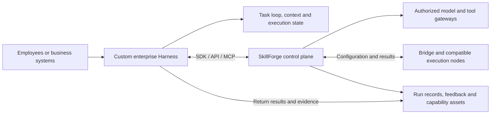

# Projects, shared Skills and runtime integration

[中文](PROJECTS_AND_INTEGRATION.md) · **English** · [Back to README](../../README.en.md)

<a id="projects"></a>

## Project: manage applications created by individuals and departments

**Turn a person's useful tool into an application the team can find, use and maintain.** Dashboards, forms, analysis pages and internal tools built with Codex, Claude Code or other development tools can join one Project directory. Organizations track ownership, department, visibility, versions and run records, reducing reliance on personal computers, chat links and temporary services.

[](../../docs/screenshots/project-applications.jpg)

| What the organization manages | How Project represents it |
|---|---|
| Ownership and maintenance | Owner, department, description and entry point; directory views include “created by me,” department and company |
| Access | Private, department and company visibility; application access, project editing and access to other users' runs have separate checks |
| Delivered versions | Static packages or external entry points link to project versions; uploads retain package checksums and runs reference versions |
| Shared capabilities | `projectforge.yaml` declares entry points, capabilities and output contracts; Project Gateway / SDK provides authorized models, tools and data |
| Evidence after use | User, input, output, capability calls, reports, tasks and run traces; configured and governed records can enter the learning-asset workflow |

**From individual creation to organizational use:** define a task → build an application → confirm owner and department → check the package and capability declarations → an authorized member uploads or registers it → colleagues open it from the directory → results and feedback return → maintain the next version.

`sf project init --path .` prepares the project manifest, `sf project doctor --path .` checks the entry and contracts, and `sf project submit --path .` uploads a static package or registers an external URL through platform APIs. Check ownership and visibility in `projectforge.yaml` before submission. See the [project and developer-tool workflow](../../docs/guides/sf-codex-claude-workflow.md) and [synthetic project examples](../../docs/examples/projects/README.md).

Project currently focuses on lightweight web applications, dashboards, internal tools and external entry points. Applications with their own backend still need an execution environment. Registration does not automatically collect all code from personal devices, and application visibility does not grant everyone access to other users' inputs or outputs. Project registration and Skill review/publication are distinct workflows; application acceptance and release rules need to reflect their risks.

<a id="sharing"></a>

## Codex and other development tools: share Skills, tools and applications

**A method validated by one member can become a Skill that colleagues discover and reuse from Codex.** SkillForge provides the `sf` CLI, a Codex plugin entry point and MCP integration. Claude Code can use the same CLI and the repository's command instructions. Individuals and departments retain business methods, rules, prompts, tool contracts and version evidence alongside their applications.

| Shared layer | What is shared | How colleagues use it |
|---|---|---|
| **Skill: reusable methods** | Business instructions, prompts, scripts, input/output contracts and package versions | Discover own, department or visible skills; download or install authorized packages into a local workspace, then use, test or improve them |
| **MCP: reusable tools and data access** | Registered tools for organization lookup, data capabilities, run queries and analysis | Inspect the catalog from Codex or another compatible client and call through the platform under the current identity |
| **Project: reusable applications** | Web applications, dashboards and internal tools | Business users open applications in the shared directory; developers integrate and maintain them through CLI, SDK and API |

| Discover shared Skills in the development workflow | Inspect shared tool capabilities |
|---|---|
| [](../../docs/screenshots/shared-skill-commands.jpg) | [](../../docs/screenshots/shared-mcp-capabilities.jpg) |
| The `sf` plugin connects skill discovery and project integration to development. Commands are displayed only; no upload or installation was performed. | Discover tools, read/write attributes and invocation entry points. This is a selected synthetic catalog with zero calls. |

The sharing workflow is **capture an individual method → test and submit for review → share within authorized scope → colleagues install and reuse → test and submit subsequent changes for review**. Local installation retains the Skill ID and base version. Installation, editing, review and publication are distinct; downloading a package does not publish it company-wide.

After installing `sf` and signing in to your own SkillForge deployment:

```bash
sf skill list --scope mine
sf skill list --scope department
sf skill list --scope visible
sf skill install <skill_id> --path ./skills
sf skill status --path ./skills/<skill_id>
sf mcp catalog
```

Submit changes with `sf skill submit --path ./skills/<skill_id>`. Catalog access and downloads are permission-bound. Sharing covers authorized Skill assets and capability entry points, not personal Codex accounts, subscriptions, conversation history or upstream credentials. Integration with external development tools does not restore the removed embedded Workbench coding runtime.

<a id="project-sdk"></a>

## SDKs: connect web apps, backend services and custom Harnesses

Plugins support a person's development workflow; **SDKs support programmatic execution and integration**. The same platform capabilities can be called from Codex, project pages, backend services or a custom Harness, linked to the appropriate project and run.

| Integration | Where it runs | Existing code capabilities |
|---|---|---|
| [Browser Project Gateway SDK](../../web/public/project-gateway-sdk.js) | Hosted web apps or external pages adapted to the host | Obtain run context from the parent window, record inputs, call declared capabilities and return reports/tasks without holding upstream model credentials |
| [Node / TypeScript Project SDK](../../sdk/node/index.ts) | Backend services, automation and custom Harnesses | Create runs with project credentials, call capabilities, submit outputs, upload assets and read traces; includes timeouts, error classification and bounded retries |
| [Python Project SDK](../../sdk/python/skillforge_project_sdk.py) | Python services, data processing and Agent programs | Corresponding project-run methods plus training-sample and dataset-version integration methods |
| [Skill runtime SDK](../../app/skill_runtime_sdk/skillforge_sdk.py) | Skill scripts in authorized execution environments | Use execution context to access platform data, tools and analysis while retaining data evidence |

The basic path is **project identity → create a run → record inputs → call authorized capabilities → return outputs/reports/tasks → inspect the trace → retain reusable evidence under governance rules**. Project SDK credentials have project scope, operation scopes, expiry and revocation; backend credentials stay server-side. Deployers still configure models, tools and training environments, and SDK integration alone does not make logs a qualified training dataset.

SDKs are provided as repository source; this does not imply published npm/PyPI packages or installation in arbitrary clients without adaptation. The [Project models](../../app/projects/models.py), [API](../../app/projects/router.py) and [service](../../app/projects/service.py) show ownership, versioning, access checks and execution records.

<a id="harness"></a>

## How people and AI collaborate

SkillForge connects business standards, implementation, use and review in one collaboration process.



This is a generic responsibility model, not a real reporting hierarchy or an application-permission map. Business ownership → delivery → review → authorized use → outcome feedback forms the collaboration loop. See the [organization, delivery, Harness runtime and improvement diagrams](../../docs/public/OPERATING_MODEL.en.md); the [data and training flow](DATA_AND_TRAINING.en.md#training) explains asset movement separately.

| Role | Responsibility | Handoff |
|---|---|---|
| Business owner | Define the problem, rules, acceptable results and approval boundaries | Task brief, decision criteria, positive examples and counterexamples |
| Product / AI team | Translate the task into skills, workflows and user interfaces | Input/output contracts, interactions, tool scope and acceptance plan |
| Developers and AI coding tools | Implement, debug, add tests and submit through authorized interfaces | Testable implementation, version and change description |
| Reviewers and administrators | Check access, risk, quality and release configuration | Reviewed version and explicit scope of use |
| Users | Run tasks and handle steps requiring human judgment | Actual outcomes, corrections and failure feedback |

CLI, SDK and MCP interfaces let AI coding tools participate in implementation and validation. Platform authorization still applies. Saving, submitting for review and releasing are distinct states: generated code or a saved draft does not automatically acquire production execution rights.

The platform manages skill assets, permissions, review, configuration distribution and observability. Scheduled execution primarily belongs to runtime nodes, with a platform fallback path. Business-rule management can therefore remain separate from the specific execution environment.

The repository also contains its own orchestration foundations. AgentCore uses LangGraph to organize generation and checks, with checkpoints and human-interruption recovery. Playbooks and execution services compose skills and dispatch to nodes. External Harness integration extends this control plane with a team's own execution approach; business workflows need not all use the same Agent loop.

### Integrating a custom Harness

Teams with an existing Agent service, or those that want to own its execution logic, can keep their Harness and connect it through an adapter. The Harness determines how a task runs. SkillForge manages which capabilities are available, who may use them, which versions have been reviewed and how outcomes are retained. Explicit identity, input/output contracts and execution records connect the two.



| Integration need | Existing foundation | What the custom Harness must implement |
|---|---|---|
| Orchestrate tasks and use platform capabilities | Python / TypeScript Project SDKs and HTTP APIs | Create runs with project authorization, submit inputs, invoke capabilities, return outputs and read traces |
| Give an Agent access to enterprise tools | MCP gateway and local stdio proxy | Discover authorized tool definitions, translate calls and results, and respect write confirmation and idempotency requirements |
| Execute skills in an environment you control | Bridge and node protocols | Adapt task and version distribution, identity verification, status and result reporting; validate cancellation and failure recovery |

Start with one read-only task: **authorize a project → create a run → obtain inputs → invoke an authorized capability → return results → verify execution records**. Model and tool credentials remain with the respective server-side services. Integrations use scoped authorization rather than extracting upstream secrets from the platform. Notifications, business-data changes and other external actions must follow the relevant tool's authorization and confirmation rules.

Source entry points: [Python SDK](../../sdk/python/skillforge_project_sdk.py), [TypeScript SDK](../../sdk/node/index.ts), [Project API](../../app/projects/router.py) and [Bridge deployment](../../bridge/README.md). These provide integration foundations; a custom Harness still requires an adapter and acceptance testing. The existing Bridge targets compatible gateway protocols, so arbitrary Agent runtimes should not be assumed to work without configuration or adaptation.

### Unified capability gateway and distributed execution

SkillForge separates centralized control from distributed execution. Business applications and custom Harnesses use a shared capability gateway to invoke models, tools and business data. The platform manages authorization, versions, quotas and execution records; compatible nodes perform the tasks. Teams can reuse integration and operational controls while retaining execution feedback as knowledge, sample candidates and evaluation material.

The architecture also aims to reuse connected spare servers and workstations for inference, small-model fine-tuning and image generation. Training and selected media paths consider capabilities, idle GPUs, free VRAM or queues; image generation requires the appropriate service or runner, with each path accepted separately. Arbitrary devices and universal automatic scheduling are not established. Speed and cost benefits require workload comparisons. See [resource reuse and its requirements](../guides/project-gateway-sdk.md#复用企业闲置算力) (Chinese).

| What needs coordination | Current implementation | Business value |
|---|---|---|
| Model and tool calls across applications | Project SDKs, model profiles, MCP capabilities and access scopes | Reduce repeated integration and separate applications from provider credentials |
| Tasks and state across nodes | Bridge dispatch and result reporting, node schedules, platform fallback, worker registry and task queue | Manage tasks, versions and exceptions across execution environments |
| Concurrency, duplicate requests and quotas | PostgreSQL task claiming and scheduler locks, request idempotency and Redis rate limiting across processes | Reduce duplicate execution and consumption while controlling resource use |
| Operational evidence and improvement inputs | Run traces, model usage attribution, feedback and training-asset interfaces | Connect calls to business tasks and support quality, cost and model-improvement decisions |

These are implemented coordination mechanisms, not proof of a highly available cluster or measured throughput. Bridge connections remain process-local; rate limiting currently fails open when Redis is unavailable; resident-model and training-sink paths retain fixed-node compatibility constraints. General node routing, cross-instance failover and large-scale concurrency require further validation. See the [gateway responsibilities and boundaries](../../docs/guides/project-gateway-sdk.md#网关职责与分布式协作) (Chinese).
