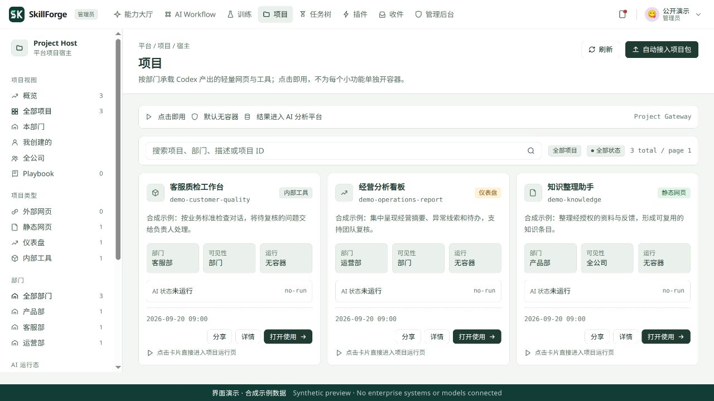
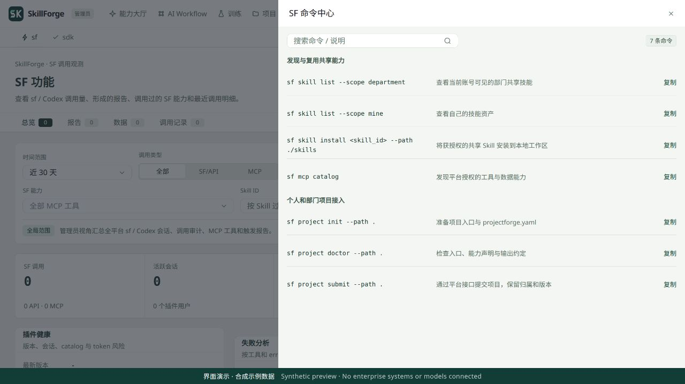
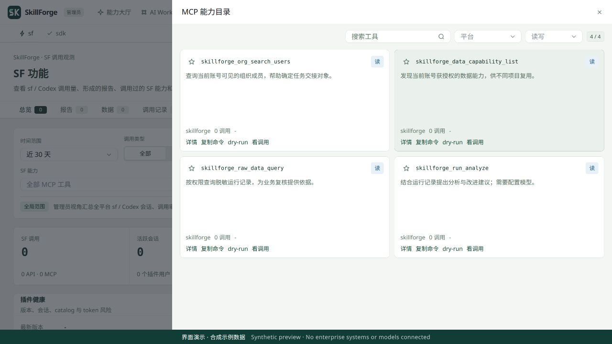
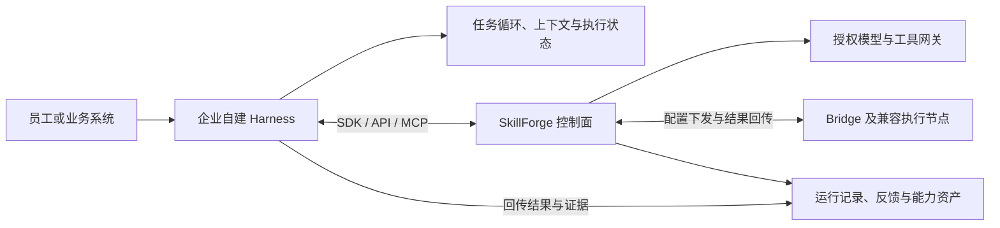

# 项目、共享 Skill 与运行接入

**中文** · [English](PROJECTS_AND_INTEGRATION.en.md) · [返回 README](../../README.md)

<a id="projects"></a>

## Project：统一管理每个人、每个部门做出的应用

**让个人做出的工具成为团队找得到、用得上、有人维护的企业项目。** 员工借助 Codex、Claude Code 或其他开发工具制作的看板、表单、分析页和内部工具，可以接入同一个 Project 目录。企业按负责人、部门、可见范围、版本和运行记录管理这些成果，减少应用散落在个人电脑、聊天链接或临时服务中的情况。

[](../../docs/screenshots/project-applications.jpg)

| 企业要管理什么 | Project 中如何承载 |
|---|---|
| 谁做的、由谁维护 | 项目保存负责人、部门归属、说明与入口；目录提供“我创建的”“本部门”“全公司”等视图 |
| 谁可以使用 | 项目支持个人、部门和全公司可见范围；查看应用、编辑项目、读取他人的运行记录分别受权限约束 |
| 交付了哪个版本 | 静态应用包或外部网页入口关联项目版本；包上传保留校验值，运行记录关联版本 |
| 如何接入公共能力 | 在 `projectforge.yaml` 中声明入口、能力与输出约定；通过 Project Gateway / SDK 使用授权模型、工具和数据 |
| 用过以后留下什么 | 关联使用者、输入、输出、能力调用、报告、待办和运行 trace；经配置与治理的记录可进入学习资产流程 |

**从个人创作到企业使用：** 定义业务任务 → 用开发工具制作应用 → 确认负责人和部门 → 检查项目包与能力声明 → 有权提交的成员上传或登记 → 员工在项目目录打开 → 回传结果与反馈 → 维护下一版本。

`sf project init --path .` 准备项目声明，`sf project doctor --path .` 检查入口与约定，`sf project submit --path .` 通过平台接口上传静态包或登记外部 URL。提交前需核对 `projectforge.yaml` 的归属与可见范围；接入步骤见[项目与开发工具使用指南](../../docs/guides/sf-codex-claude-workflow.md)，最小材料见[合成项目示例](../../docs/examples/projects/README.md)。

当前 Project 主要承载轻量网页、看板、内部工具与外部入口；带独立后端的应用仍需自己的运行环境。项目登记不代表自动接管个人电脑上的所有代码，应用可见也不代表所有成员都能读取其他人的输入输出。Project 上传登记与 Skill 审核发布是不同流程，仍需按应用风险配置验收与上线规则。

<a id="sharing"></a>

## Codex 等开发工具：共享 Skill、工具和项目成果

**一位成员验证过的方法，可以成为其他成员在 Codex 中发现和复用的 Skill。** SkillForge 提供 `sf` CLI、Codex 插件入口与 MCP 接入；Claude Code 可使用同一 CLI 和仓库中的命令说明。个人和部门积累的不只是一个应用，也包括完成业务任务的方法、规则、提示词、工具约定和版本依据。

| 共享层次 | 共享什么 | 同事如何使用 |
|---|---|---|
| **Skill：复用方法** | 业务说明、提示词、脚本、输入输出约定及技能包版本 | 按本人／部门／可见范围发现技能，获授权后拉取或安装到本地工作区，继续使用、测试或改进 |
| **MCP：复用工具与数据接入** | 平台登记的组织查询、数据能力、运行查询与分析等工具 | 在 Codex 或其他兼容客户端查看目录，按当前身份通过平台调用，无需每人重复连接业务系统 |
| **Project：复用业务应用** | 已制作的网页、看板和内部工具 | 业务同事在统一目录打开应用；开发者通过 CLI、SDK 和 API 接入及维护 |

| 在开发工具中发现共享 Skill | 在平台查看共享工具能力 |
|---|---|
| [](../../docs/screenshots/shared-skill-commands.jpg) | [](../../docs/screenshots/shared-mcp-capabilities.jpg) |
| `sf` 插件把技能发现、项目接入等操作带进开发工作流；图片只展示命令，没有执行上传或安装。 | 查找工具、了解读写属性及调用入口；图片中的目录为选取的合成示例，调用数为零。 |

共享 Skill 的流程是 **个人沉淀 → 测试并提交审核 → 按授权范围共享 → 同事安装复用 → 修改后再次测试、提交审核**。本地安装保留技能 ID 与基础版本；安装、修改、审核和发布分别记录，不能把“下载到本地”当作“已发布给全公司”。

在已安装 `sf` 并登录自己的 SkillForge 后，可以这样发现和复用：

```bash
sf skill list --scope mine
sf skill list --scope department
sf skill list --scope visible
sf skill install <skill_id> --path ./skills
sf skill status --path ./skills/<skill_id>
sf mcp catalog
```

修改后的 Skill 通过 `sf skill submit --path ./skills/<skill_id>` 提交审核。目录与下载受平台权限限制；共享的是获授权的技能资产和能力入口，不是个人 Codex 账号、订阅、对话历史或上游密钥。插件使用外部开发工具，并不表示公开版已经恢复内置 Workbench 编程运行时。

<a id="project-sdk"></a>

## SDK：让网页、后端服务和自建 Harness 使用同一套能力

插件服务于人的开发工作流，**SDK 服务于程序的运行与集成**。同一套平台能力既可从 Codex 中调用，也可由项目页面、后端服务或自建 Harness 调用，并关联到相应项目与运行记录。

| 接入方式 | 适用位置 | 已有代码能力 |
|---|---|---|
| [浏览器 Project Gateway SDK](../../web/public/project-gateway-sdk.js) | 平台宿主中的网页，或完成宿主适配的外部页面 | 通过父窗口取得运行上下文，记录输入、调用声明的能力、回传报告和待办；网页不持有上游模型密钥 |
| [Node / TypeScript Project SDK](../../sdk/node/index.ts) | 后端服务、自动化程序、自建 Harness | 使用项目凭据创建运行、调用能力、提交输出、上传资产和读取 trace；提供超时、错误分类及有限重试 |
| [Python Project SDK](../../sdk/python/skillforge_project_sdk.py) | Python 服务、数据处理和 Agent 程序 | 提供相应的项目运行接口，并支持训练样本与数据集版本等接入方法 |
| [Skill 运行 SDK](../../app/skill_runtime_sdk/skillforge_sdk.py) | 获授权运行环境中的 Skill 脚本 | 使用执行上下文访问平台数据／工具和分析能力，并保留数据依据 |

基本调用链为 **项目身份 → 创建运行 → 记录输入 → 调用授权能力 → 回传输出／报告／待办 → 查看 trace → 按治理规则保留可复用经验**。Project SDK 凭据按项目与 scope 管理，具有有效期和吊销入口；后端凭据留在服务端。模型、工具和训练环境仍需部署者配置，运行日志也不会仅因接入 SDK 就自动成为合格训练集。

SDK 以仓库源码提供，不意味着已经发布到 npm / PyPI 或任意客户端都能免适配安装。[Project 数据模型](../../app/projects/models.py)、[API](../../app/projects/router.py)及[项目服务](../../app/projects/service.py)给出归属、版本、权限与执行记录的具体实现。

<a id="harness"></a>

## 人与 AI 如何协作

SkillForge 将业务标准、实现、使用和审核放在同一条协作链上。



这是通用职责图，不是企业真实组织架构或系统权限映射。业务负责人 → 建设团队 → 审核 → 授权使用 → 结果反馈构成协作闭环。展开阅读[组织运行、业务交付、Harness 调用与改进决策四张图](../../docs/public/OPERATING_MODEL.md)；[数据与训练图](DATA_AND_TRAINING.md#training)继续说明资产如何流转。

| 角色 | 负责什么 | 交付给下一环节 |
|---|---|---|
| 业务负责人 | 定义问题、业务规则、可接受结果与审批边界 | 需求说明、判断标准、正例与反例 |
| 产品 / AI 团队 | 将需求组织为技能、流程和用户界面 | 输入输出约定、交互、工具范围与验收方案 |
| 开发者与 AI 编程工具 | 实现、调试、补充测试，通过授权接口提交 | 可测试的实现、版本及变更说明 |
| 审核者与管理员 | 检查权限、风险、质量与发布配置 | 经审核的版本和明确的使用范围 |
| 使用者 | 执行任务，处理需要人工判断的步骤 | 实际结果、纠正意见和失败反馈 |

开发者可通过 CLI、SDK 和 MCP 接口让 AI 编程工具参与实现与验证。接入时仍需完成平台授权；保存、提交审核、发布是不同状态，生成代码或保存草稿不会自动获得生产执行权限。

平台负责技能资产、权限、审核、配置下发和观测；实际定时执行优先交给运行节点，平台保留补偿路径。这样可以将业务规则管理与具体运行环境分开。

仓库本身也包含自建编排基础：AgentCore 使用 LangGraph 组织生成和检查步骤，提供检查点及人工中断恢复；Playbook 和执行服务负责组合技能与节点调度。下述外部 Harness 接入是在这套控制面上扩展自己的运行方式，不要求所有业务都使用同一个 Agent 循环。

### 通过自建 Harness 集成

已有 Agent 服务或希望掌握运行逻辑的团队，可以保留自己的 Harness，通过适配层接入 SkillForge。Harness 负责“一次任务怎样运行”；SkillForge 负责“哪些能力可用、由谁使用、哪个版本经过审核，以及结果如何保留”。两者通过明确的身份、输入输出与执行记录关联。



| 接入需求 | 现有接入基础 | 自建 Harness 需要完成的工作 |
|---|---|---|
| 自己编排任务，调用平台能力 | Python / TypeScript Project SDK 与 HTTP API | 使用项目授权创建运行、提交输入、调用能力、回传输出并读取 trace |
| 让 Agent 使用企业工具 | MCP 网关与本地 stdio 代理 | 读取获授权的工具描述，转换调用与结果，遵守写入确认和幂等要求 |
| 在自有环境执行技能 | Bridge 与节点协议 | 适配任务与版本下发、身份认证、状态和结果回报，验证取消及异常恢复 |

建议先打通一个只读任务：**项目授权 → 创建运行 → 获取输入 → 调用授权能力 → 回传结果 → 核对执行记录**。模型与工具凭据由对应服务端管理；接入方使用受限授权，不从平台提取上游密钥。需要通知、修改业务数据或其他外部动作时，应按具体工具的授权与确认规则执行。

代码入口：[Python SDK](../../sdk/python/skillforge_project_sdk.py)、[TypeScript SDK](../../sdk/node/index.ts)、[项目 API](../../app/projects/router.py)、[Bridge 部署](../../bridge/README.md)。这些是现有集成基础；自建 Harness 仍需实现适配并完成验收。现有 Bridge 面向兼容的网关协议，不能据此认为任意 Agent 运行时都能免配置接入。

### 统一能力网关与分布式执行

SkillForge 采用“统一管控、分布式执行”的设计：业务应用与自建 Harness 通过统一能力网关调用模型、工具和业务数据，平台管理授权、版本、调用额度和执行记录，兼容节点承担具体任务。企业可以复用同一套能力接入与运行管理机制，并把执行反馈积累为知识、样本和评估材料。

这套体系也用于复用企业已接入的闲置服务器和工作站资源，承接模型推理、小模型微调及生图等需求。训练与部分媒体路径会参考节点能力、闲置 GPU、可用显存或队列；生图需配置对应服务或运行器，各类路径分别验收。尚不能宣称任意设备都能统一自动接单；是否更快、更省需对照真实负载。详见[资源复用的实现与条件](../guides/project-gateway-sdk.md#复用企业闲置算力)。

| 企业需要统筹什么 | 当前实现基础 | 业务价值 |
|---|---|---|
| 不同应用的模型与工具调用 | 项目 SDK、模型配置、MCP 能力接入及权限范围 | 减少重复集成，将业务应用与具体模型、工具凭据分开 |
| 多节点任务与运行状态 | Bridge 任务下发和状态回传、节点定时、平台补偿、Worker 注册及任务队列 | 在不同执行环境中管理任务、版本和异常处理 |
| 并发、重复请求与额度 | PostgreSQL 并发领取和调度锁、请求幂等、Redis 跨进程限流 | 降低重复执行与重复消耗，约束资源使用 |
| 使用过程与改进依据 | 运行 trace、模型用量归因、结果反馈及训练资产接口 | 将一次调用关联到业务任务，为质量、成本和后续模型优化提供依据 |

这些是代码中的分布式协作机制，不是高可用集群或性能指标的验收声明。Bridge 连接注册仍在进程内；Redis 不可用时当前限流会放行，常驻模型及训练出口仍有固定节点兼容约束。任意节点路由、跨实例故障切换和大规模并发需继续验证。详见[网关职责与实现边界](../../docs/guides/project-gateway-sdk.md#网关职责与分布式协作)。
