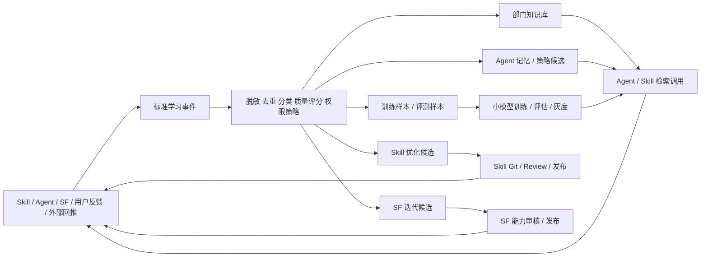

# SkillForge 智能正向循环 PRD：知识库 / Agent / 训练 / SF / Skill 串联

> **阅读范围**：本文保留原项目的设计与版本演进记录，不作为公开准备版的安装或验收指南。正文中的“当前／已完成／已上线”须结合当时版本理解；现行可用范围见[能力地图](../public/CAPABILITIES.md)，实测范围见[验证记录](../public/VALIDATION.md)。规范性权限与审核要求不因该说明而放宽。


日期：2026-06-01

状态：产品需求文档 v1，作为 `docs/spec/intelligence-learning-loop.md` 的需求入口和验收口径。
关联实现规格：`docs/spec/intelligence-learning-loop.md`。

## 1. 背景

SkillForge 已经具备 Skill 执行、部门知识库、Agent Runtime、训练控制面、SF/MCP 调用、Inbox/TaskTree 等模块，但这些模块如果只各自工作，会出现三个问题：

1. **数据沉淀断点**：Skill 运行结果、用户反馈、SF 分析报告、平台回推数据没有稳定沉淀为部门知识和训练样本。
2. **优化闭环断点**：Agent、Skill、SF 的失败和高频需求不能自动变成可审核的优化候选。
3. **观测断点**：用户看不到一份数据从产生、脱敏、入库、训练、部署到再次被调用的完整流动链路。

本需求的目标是把“运行结果 -> 知识 -> Agent -> 训练 -> Skill/SF 迭代 -> 再运行”的循环做成平台级能力。

## 2. 一句话目标

把 Skill 运行结果、用户通过平台发送的数据、外部系统回推数据、SF 调用结果、Agent 会话和训练结果统一纳入一条可治理、可追踪、可观察的智能数据流，自动形成部门知识库、自动积累训练样本、自动优化 Agent 和 Skill，并把高频需求沉淀为 SF 能力迭代候选。

## 3. 核心闭环



关键原则：**自动产生候选，不能自动越权发布**。知识入库、训练任务、模型部署、Skill 代码变更、SF 能力发布都必须保留权限、审核、灰度和回滚。

## 4. 需求范围

### 4.1 本期必须覆盖

| 模块 | 必须串联的数据 | 自动动作 | 人工治理点 |
| --- | --- | --- | --- |
| Skill | 运行结果、报告、待办、失败、DecisionLog、用户反馈 | 生成学习事件、报告摘要、训练样本、Skill 优化候选 | Skill Git、审核、发布 |
| 知识库 | 报告摘要、确认过的任务复盘、SOP、SF/Agent 稳定结论、多模态素材 | 自动 upsert 部门知识，写入来源血缘和检索日志 | 敏感数据审核、知识纠错、过期处理 |
| Agent | 会话结果、工具调用、知识引用、失败节点、用户采纳/驳回 | 生成 Agent 记忆、策略候选、知识缺口候选 | 策略审核、权限边界、上下文引用 |
| 训练 | 反馈样本、动作结果样本、失败样本、评测样本 | 生成 dataset manifest、训练候选任务 | 训练审批、评估门禁、模型部署审批 |
| SF | MCP 调用、调用失败、重复组合调用、生成报告、run analyze/candidate | 统计调用量、沉淀报告、生成 SF 迭代候选 | dry-run/real/idempotency、能力审核 |
| 可观察页面 | 事件、资产、血缘、候选、审核、模型部署结果 | 展示数据如何跨页面流动 | 用户筛选、追溯、人工处理卡点 |

### 4.2 暂不做或必须禁止

1. 不允许 AI 直接改生产 Skill 并发布。
2. 不允许模型训练完成后直接替换生产路由。
3. 不允许把 API Key、Cookie、Token、客户原始敏感数据写入知识库、overlay、run trace 或日志。
4. 不允许知识库、Agent、训练、SF、Skill 两两硬连；必须通过统一学习事件和血缘层串联。
5. 不允许为了自动化绕过部门 / Skill 权限体系。

## 5. 角色和核心用户故事

| 角色 | 用户故事 | 验收标准 |
| --- | --- | --- |
| 业务负责人 | 我想看到部门里哪些 Skill、Agent、SF 调用正在产生价值 | 数据流页有按部门、Skill、Agent、SF 工具筛选的 KPI 和趋势 |
| 运营人员 | 我希望 Skill 生成的报告和已完成待办自动沉淀成知识 | 报告/待办完成后自动生成知识候选或知识文档，并可追溯来源 |
| Agent 使用者 | 我希望 Agent 回答能引用部门最新知识，并说明依据 | Agent 回答展示引用来源，低置信度时提示补数据或拒答 |
| 训练负责人 | 我希望平台自动积累可训练的小模型样本 | 训练页可看到样本来源、质量分、血缘、manifest 和审批状态 |
| SF 负责人 | 我希望看到 SF 被调用了哪些能力、哪些高频失败或重复流程值得产品化 | SF 页能展示调用量、报告、失败模式、迭代候选和处理进度 |
| Skill 开发/审核人 | 我希望失败和低评分自动变成可评审的优化候选 | 候选携带证据、影响面、风险等级，并进入 Review / Todo |

## 6. 数据进入闭环的来源

| 来源 | 典型数据 | 默认策略 |
| --- | --- | --- |
| Skill 运行 | summary、reports、todos、output_result、错误、耗时、成本 | 成功报告可入库；失败转优化候选；低评分转评测样本 |
| 用户通过平台发送 | 表单、上传文件、反馈、确认/驳回、任务回执 | 脱敏后按类型进入知识候选、训练样本或忽略 |
| 外部系统回推 | 订单、客服、营销、数据采集回调 | 原始明细只存引用；摘要和确认指标可入库 |
| SF 调用 | MCP 工具、参数摘要、成功/失败、报告、run analyze | 统计调用量；失败/高频组合生成 SF 迭代候选 |
| Agent 会话 | 对话、工具调用、知识引用、恢复点、用户反馈 | 成功经验转记忆；失败转策略候选；纠错转偏好样本 |
| 训练与模型部署 | 训练任务、指标、评估、灰度结果、回滚原因 | 指标进知识；样本和模型写血缘；部署需审批 |

## 7. 跨模块流转规则

### 7.1 Skill -> 部门知识库

- Skill 完成运行后，抽取报告结论、指标解释、操作建议、完成待办复盘。
- 通过脱敏、去重、质量评分后进入部门知识库或知识审核候选。
- 知识文档必须记录来源：`run_id`、`decision_log_id`、`todo_id`、`skill_id`、部门、时间、策略结果。
- 同一报告更新应 upsert 旧文档，不重复创建。

### 7.2 知识库 -> Agent / Skill

- Agent 和 Skill 在生成回答、报告、复盘时可检索部门知识。
- 每次检索和引用都要记录 `used_as_context` 血缘。
- 回答必须展示来源或至少可在详情中追溯来源。
- 低置信度、知识过期、权限不足时不得编造结论。

### 7.3 Skill / 用户反馈 -> 训练

- 用户采纳、驳回、评分、纠错、业务结果回填后，生成 SFT、偏好、动作结果或评测样本。
- 样本进入受控 manifest，不直接暴露原始业务 payload。
- 达到样本阈值后可自动创建 `awaiting_review` 训练候选。
- 训练、评估、灰度、激活和回滚必须走训练控制面。

### 7.4 Agent -> 知识库 / 训练 / Skill

- 高频成功回答可沉淀为 Agent 记忆或知识候选。
- 用户纠正 Agent 输出时生成偏好样本和评测样本。
- 反复手工流程生成 Skill 创建候选。
- 工具选择错误、上下文缺失、风险中断生成 Agent 策略候选。

### 7.5 SF -> Skill / 知识库 / SF 迭代

- SF MCP 调用写入审计和学习事件。
- SF 生成的稳定报告模板可进入知识库或报告模板候选。
- 多人重复组合调用生成“固化为新 SF 命令 / 新 Skill”的候选。
- 高频失败生成 SF 工具修复候选。
- SF 写工具保持 dry-run / real / idempotency key 规则。

### 7.6 训练 -> Agent / Skill

- 训练完成后，评估指标进入训练知识和模型血缘。
- 模型部署申请必须人工审批，可灰度、激活、回滚。
- Agent / Skill 调用模型时记录使用了哪个模型部署版本。
- 灰度后业务效果反哺到训练和候选优先级。
- 训练任务必须写回样本来源血缘：`ImprovementCandidate / Run / Skill / LearningArtifact -> TrainingJob`，避免模型效果无法追溯到原始反馈和样本。
- 训练网关 callback 返回的指标和模型产物必须进入学习流，写回 `TrainingJob -> ModelArtifact`，并在数据流页可追踪到后续部署。
- 模型部署必须写回效果血缘：`TrainingJob -> ModelDeployment -> Skill`；部署被驳回或回滚时生成 `training_improvement_candidate`，进入训练治理队列而不是静默失败。
- 回滚时必须保留 `rollback_target` 边，页面能看见哪个部署被回滚、回滚到哪个版本，以及后续是否产生新的评测样本或训练任务。

## 8. 可观察页面需求

新增或持续完善统一页面：`数据流 / 智能闭环`。

### 8.1 总览区

必须展示：

- 捕获事件数
- 已入库知识数
- 待审核知识候选数
- 新增训练样本数
- 训练候选任务数
- Agent 使用知识次数
- Skill 优化候选数
- SF 迭代候选数
- 自动化成功率
- 平均入库延迟

### 8.2 流动式拓扑画布

固定阶段：

```text
数据源 -> 标准事件 -> 学习资产 -> 自动物化 -> 反哺迭代候选 -> 治理闭环
```

每个阶段需要展示：节点数量、热度、状态、最近事件、来源类型。连接器需要展示捕获、抽取、物化、反哺、治理的数量和方向。

### 8.3 详情抽屉

点击节点展示：

- 来源对象和链接
- 脱敏摘要
- 部门 / 权限范围
- 策略决策
- 质量分和置信度
- 证据列表
- 下游对象
- 错误和卡点
- 可执行动作：入库、忽略、采纳、驳回、创建评审、创建训练候选

### 8.4 嵌入现有页面

| 页面 | 需要增加的闭环信息 |
| --- | --- |
| 知识库 | 文档来源、被哪些 Agent/Skill 使用、生成了哪些样本或候选；知识文档详情需嵌入数据流，展示来源与被引用路径 |
| Agent | 本次使用的知识、模型、Skill、工具调用和反馈沉淀情况 |
| 训练 | 样本血缘、质量分、来源 Skill/Agent/SF、模型产物、部署效果；训练任务详情需嵌入小型数据流卡片，能直接跳到完整 `/learning-flow` |
| SF | 调用量、失败工具、生成报告、迭代候选、能力固化进度；SF 页需嵌入能力级和单次调用级数据流，展示调用如何反哺知识 / 候选 / Skill |
| Skill Studio | 该 Skill 贡献的知识、样本、评测、候选和发布后效果 |
| Inbox/TaskTree | 报告/待办能纳入知识库、标记训练样本、生成改进候选 |

## 9. 智能策略和防呆

| 策略 | 自动动作 | 防呆 |
| --- | --- | --- |
| `auto_index` | 自动写知识库并索引 | 仅限脱敏、质量达标、非敏感摘要 |
| `review_first` | 生成知识审核候选 | 人工确认后才入库 |
| `training_candidate_only` | 进入训练样本池 | manifest 不返回原始 payload |
| `agent_memory_only` | 写 Agent 记忆 | 仅当前部门 / 授权范围可用 |
| `improvement_candidate` | 生成 Skill/SF/Agent 候选 | 进入 Review / Todo，不直接发布 |
| `ignore` | 不沉淀 | 记录忽略原因，便于审计 |

默认规则：

1. sandbox、sample preview、dry-run 输出默认不入知识库。
2. 成功报告摘要、已确认业务指标、任务完成复盘可自动入库。
3. 原始订单、客服对话、客户信息、密钥类数据必须待审核或只做引用。
4. 失败、低评分、驳回优先生成评测样本和优化候选。
5. 重复候选只追加证据和提升优先级，不重复创建。

## 10. 数据模型和接口要求

研发实现以 `docs/spec/intelligence-learning-loop.md` 为准，产品层必须保证以下对象存在：

- `learning_events`：统一学习事件，append-only。
- `learning_artifacts`：知识、报告摘要、训练样本、Agent 记忆、候选等标准资产。
- `learning_flow_edges`：跨模块血缘边。
- `learning_ingestion_jobs`：物化到知识库、训练、Agent 记忆、候选池的任务记录。
- `improvement_candidates`：Skill / Agent / SF / 知识库 / 训练的改进候选池。

核心 API：

```text
GET  /api/learning/summary
GET  /api/learning/events
GET  /api/learning/artifacts
GET  /api/learning/flow-graph
GET  /api/learning/flow-topology
GET  /api/learning/flow-journeys
GET  /api/learning/entities/{type}/{id}/lineage
GET  /api/learning/candidates
GET  /api/learning/training-manifest
POST /api/learning/events/backfill
POST /api/learning/artifacts/{id}/materialize
POST /api/learning/artifacts/{id}/ignore
POST /api/learning/candidates/{id}/accept
POST /api/learning/candidates/{id}/reject
POST /api/learning/candidates/{id}/create-review
POST /api/learning/candidates/{id}/create-training-job
```

## 11. 验收标准

### 11.1 端到端闭环验收

1. Skill 真实运行完成后，数据流页能看到 `Run -> DecisionLog -> Report / Todo`。
2. 报告入库后，能看到 `Report -> KnowledgeDocument`。
3. Agent 或 Skill 使用知识后，能看到 `KnowledgeDocument -> Query / Agent Context / Skill Context`。
4. 用户反馈后，能看到 `DecisionLog -> TrainingSample / EvalCase`。
5. 训练候选创建后，能看到 `TrainingSample -> TrainingJob -> ModelDeployment`。
6. 模型灰度后再次被 Agent/Skill 调用，能看到 `ModelDeployment -> Agent/Skill Runtime`。
7. SF MCP 调用失败后，能看到 `SF Call -> SF Iteration Candidate`。
8. 高频 SF 组合调用后，能看到“固化为 SF 命令或 Skill”的候选。
9. 任意节点详情不暴露未脱敏原始 payload。
10. 所有候选进入审核/待办/Review，不直接改变生产态。

### 11.2 页面验收

- 页面首屏能解释“数据从哪里来、流到哪里去、卡在哪里”。
- 所有 KPI 有口径说明。
- 拓扑画布至少包含 6 个固定阶段。
- 支持按部门、Skill、Agent、SF 工具、事件类型、资产类型、状态、时间过滤。
- 详情抽屉能跳转回原始页面：Run Trace、Knowledge、Training、SF、Skill Studio、Inbox/TaskTree。

### 11.3 治理验收

- 普通用户只能看自己有权限的部门和 Skill 数据。
- 管理员可看跨部门汇总，但明细仍遵守敏感数据脱敏。
- 训练样本 manifest 不返回原始业务 payload。
- Skill 代码变更必须有 Git commit、审核、发布记录。
- 模型部署必须有审批、灰度、激活和回滚记录。

## 12. 成功指标

| 指标 | 目标方向 |
| --- | --- |
| 报告自动入库率 | 持续提升，减少重复写 SOP |
| 知识引用后采纳率 | 持续提升 |
| 低评分问题进入候选率 | 接近 100% |
| 训练样本有效率 | 持续提升，低质样本下降 |
| SF 高频流程固化率 | 持续提升 |
| Skill 发布后成功率提升 | 可量化对比发布前后 |
| 人工重复操作耗时 | 持续下降 |
| 数据流卡点平均处理时长 | 持续下降 |

## 13. 分期路线

| 阶段 | 目标 | 交付物 |
| --- | --- | --- |
| Phase 1 | 先看见数据流 | learning 事件、资产、血缘、summary、flow graph/topology/journeys、数据流页 |
| Phase 2 | 自动形成部门知识 | 报告/待办/反馈自动入库、知识来源和使用血缘 |
| Phase 3 | 自动积累训练样本 | 训练样本池、manifest、训练候选、评测样本 |
| Phase 4 | Agent 自动吸收经验 | Agent 记忆、策略候选、知识缺口候选 |
| Phase 5 | Skill / SF 自动迭代候选 | 高频失败/重复流程识别、候选审核、Review/Todo 联动 |
| Phase 6 | 效果驱动优先级 | 发布前后效果对比、候选收益排序、自动推荐下一步优化 |

## 14. 关联文档

- `docs/architecture/intelligence-data-flow-positive-loop.md`：需求讨论沉淀和总体架构，定义正向循环的数据流、可观察页面和分阶段路线。
- `docs/spec/intelligence-learning-loop.md`：研发规格、数据模型、API、Phase 1-6 技术拆分。
- `docs/reviews/2026-06-01-intelligence-learning-loop-delivery-evaluation.md`：当前交付评估和验证记录。
- `docs/spec/department-knowledge-base.md`：部门知识库、LightRAG、多模态和后台 RAG 配置。
- `docs/guides/sf-codex-claude-workflow.md`：SF / Codex / MCP 使用边界。
- `docs/spec/skill-personalized-ui-overlay.md`：Skill 个人 UI overlay 和 AI 不能越权修改的边界。
- `docs/spec/skill-permission-unification.md`：Skill 权限统一口径。
